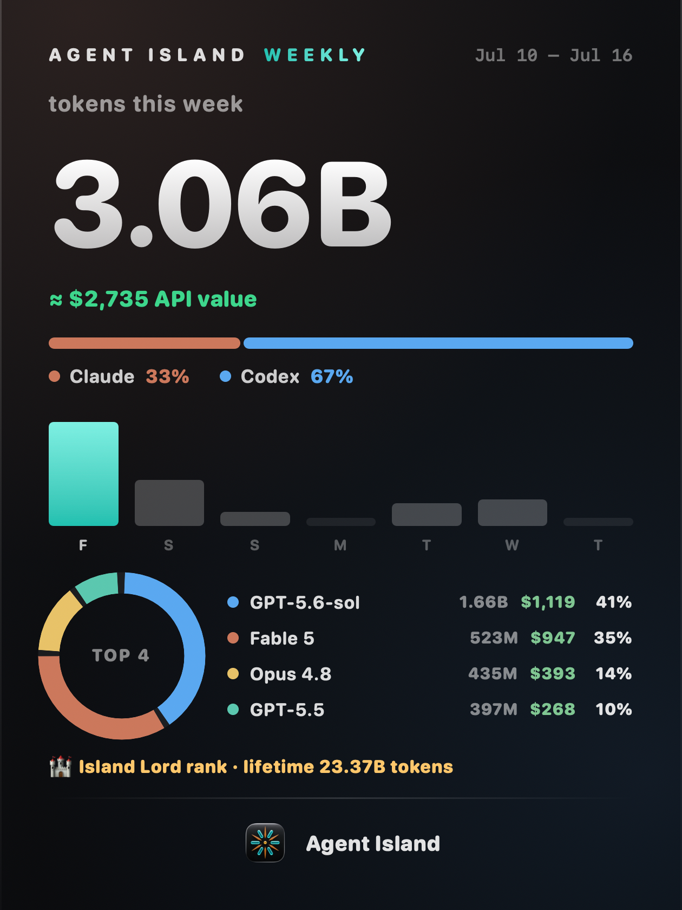
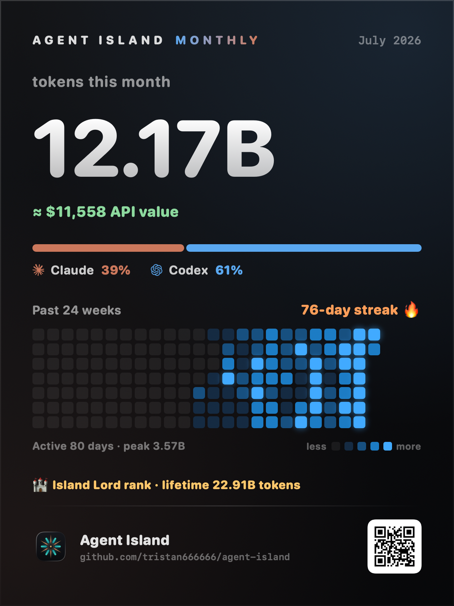
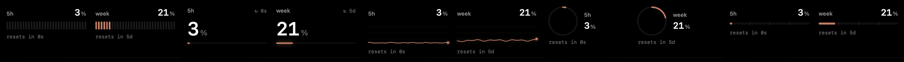

<div align="center">


# Agent Island

**A status companion for Claude Code and Codex.**

It lives in your MacBook's notch — or in a native top bar / floating widget on Windows. Spinning logo = agent working. Alarm = your turn. Red = something needs you.

On the Mac it fits notched and non-notched machines alike (notch-style or compact top bar). On Windows it's a native WPF companion with the same detection engine — as far as we know, the only one of its kind on Windows.

**[agent-island.dev](https://agent-island.dev)** · [简体中文](README.zh-CN.md)

[](https://github.com/tristan666666/agent-island/releases/latest)
[](https://github.com/tristan666666/agent-island/releases)
[](https://github.com/tristan666666/agent-island/releases/latest)
[](https://github.com/tristan666666/agent-island/releases/latest)
[](LICENSE)

[](https://github.com/jaywcjlove/awesome-mac/blob/master/README.md#menu-bar-tools)
[](https://github.com/jaywcjlove/awesome-swift-macos-apps/blob/main/README.md#ai)
[](https://github.com/milisp/awesome-codex-cli)
[](https://github.com/kailiu42/awesome-coding-agents)
[](https://github.com/GetBindu/awesome-claude-code-and-skills)
[](https://github.com/acvnace/awesome-vibe-coding-resources#desktop-apps)

<a href="https://www.producthunt.com/products/agent-island-2?embed=true&utm_source=badge-featured&utm_medium=badge&utm_campaign=badge-agent-island-2">
  
</a>


<sub><a href="https://github.com/tristan666666/agent-island/blob/main/docs/media/agentisland-1.6.1-launch-en.mp4">▶&nbsp;HD version</a></sub>

<p>
  <a href="#install"><strong>Install</strong></a> ·
  <a href="https://agent-island.dev">Website</a> ·
  <a href="https://github.com/tristan666666/agent-island/releases/latest">Latest release</a> ·
  <a href="docs/roadmap.md">Roadmap</a> ·
  <a href="CONTRIBUTING.md">Contribute</a>
</p>

<p><strong>If Agent Island saves you one stalled overnight Claude/Codex run, star it so more people running these agents — on Mac or Windows — can find it.</strong></p>


</div>

## Why

Agent Island was built by a heavy Claude Code + Codex user, out of two everyday realities:

**Squeeze every token.** Running both tools daily means juggling different quota clocks. Claude reports 5-hour and weekly windows.
Codex reports one weekly window. Cross-using them well is how you get the most out of what you pay for. So: live usage, cost, and reset countdowns for both, one glance in the top bar.

**Start the run, then go live your life.** You brief the agent for one round — then you should be able to walk away: play with your kids, hit the gym, watch a movie. The agent doesn't need you while it runs; it needs you when it stops. Agent Island watches for that exact moment and rings you when it's your turn, so coding doesn't own your evening.

That's the whole point: maximum throughput from the machines, and your life back from the loop.

## Features

### ⚡ Live status in the top bar

The Claude and Codex logos mirror what your sessions are actually doing. Detection is event-driven (FSEvents on the local transcript files), so the spin starts and stops within about a second of the run itself — no polling lag.

| Cue | Meaning |
|---|---|
| Logo **rotates** | a session is working |
| Logo **still** | nothing running — or the turn is over and it's yours |
| Logo **pulses red** | needs attention: rate limit, login, network, or provider error |


### 🏆 Weekly & monthly report cards — new in 1.6.1

One click renders your week (or your half-year) into a shareable card: total tokens with an "≈ API value" line, the Claude/Codex split, a TOP-5 model breakdown (tokens · dollars · share), a 24-week activity heatmap with your streak — and your **island rank**, seven lifetime tiers from 🌊 Drifter (100M) to 👑 Legendary Navigator (100B). Rendered entirely on your machine; you copy the image and post it yourself.

<table>
  <tr>
    <td align="center"></td>
    <td align="center"></td>
  </tr>
</table>

Codex **reset cards** ride along: an ×N chip in the island shows your banked resets, with an expiry popover.

### 🎨 Five looks for your quota

Command-click the island to cycle the chart style — stepped, digits, line, ring, or bars — and flip between used/remaining. Your quota, your way.



### 🖥️ Fits your desk — Mac and Windows

On the Mac, Agent Island is not limited to MacBooks with a camera notch. In Settings you can choose:

- **Wide top bar** for MacBook notch-style layouts.
- **Compact top bar** for non-notched Macs, external displays, iMac, Mac mini, and older MacBooks.

On Windows, [Agent Island for Windows](windows/) runs the same detection engine in a native WPF shell, with its own placement modes:

- **Top bar** — the signature island look, centered on the top edge.
- **Floating widget** — a draggable card that remembers its spot; a brand tray icon shows a usage ring and state color at all times.

Either way it stays a lightweight native companion — no Electron on either platform.

### 🔔 "It's your turn" alarms

When a turn finishes in a background session, Agent Island opens a foreground alarm window, posts a system notification, and plays a sound (built-in choices, or bring your own file). Alarms land a few seconds after the turn actually ends.

- **Reply and it goes away** — the alarm auto-dismisses once you answer in the thread; no stale windows.
- **Nothing gets swallowed** — if several turns finish, alarms queue; dismissing one recalls the next.
- **Open thread** takes you back: Codex sessions land on the exact thread via `codex://threads/…` delivered to the running app; Claude CLI sessions resume for real with `claude --resume` from the session's own directory; Claude Desktop sessions bring Claude Desktop to the front (no conversation-level deep link exists — anything more would be pretend).

<table>
  <tr>
    <td align="center"></td>
    <td align="center"></td>
  </tr>
</table>

### ⛽ Out-of-quota alarm

Hitting a rate limit is a different event than a finished turn, so it gets a different interruption: when a Claude quota window reaches 100%, a distinct alarm fires with its real reset time ("Resets at 15:55 (~2h)"). It fires once per reset cycle and is warmup-gated, so launching into an already-exhausted window stays silent.


### 📊 Usage island

Live usage, cost, and reset countdowns appear on swipeable pages in the notch, fed by each provider's own usage API. Claude shows 5-hour and weekly usage.
Codex shows weekly usage. When Claude's endpoint demands a fresh login, the Re-authenticate button finishes it in your browser (one click on the real claude.com authorize page, caught by a local callback) — no terminal, no code pasting.


### 🌏 Native and bilingual

Native SwiftUI — no Electron. English and 简体中文, switchable in Settings. macOS 13+, universal binary (Apple Silicon + Intel).

Windows is here too: [Agent Island for Windows](windows/) is a native WPF port with the same detection engine. More platform notes on [agent-island.dev](https://agent-island.dev).

## Install

> **On Windows?** Grab [**Agent Island for Windows**](windows/) — a native WPF port with the same detection engine ([download](https://github.com/tristan666666/agent-island/releases/latest)).

```sh
brew install tristan666666/tap/agentisland
```

**Windows** (new):

Download [`AgentIsland-win-x64.zip`](https://github.com/tristan666666/agent-island/releases/latest) from the latest release, unzip, and run `AgentIsland.exe`.

Or via Scoop:

```powershell
scoop bucket add agent-island https://github.com/tristan666666/scoop-bucket
scoop install agent-island/agentisland
```

Or via winget:

```powershell
winget install TristanTang.AgentIsland
```

or grab the DMG:

Download the DMG, drag AgentIsland into Applications, open it:

[**Download the latest AgentIsland.dmg**](https://github.com/tristan666666/agent-island/releases/latest)

If macOS blocks the first launch because the app is not notarized, right-click AgentIsland in Finder and choose **Open** once.

Or build from source:

```sh
git clone https://github.com/tristan666666/agent-island.git
cd agent-island
./scripts/verify.sh
open build/AgentIsland.app
```

## How it works

- **Session state** is read from the transcript files Claude Code, Claude Desktop, and Codex already write on your disk: FSEvents watches for writes, and end-of-turn markers (Claude's `stop_reason: end_turn`, Codex's `task_complete`) plus file activity decide spin / alarm / red.
- **Usage and reset times** come from each provider's real usage API, using the credentials already on your machine.
- Everything runs locally as you. Nothing is uploaded anywhere.

Deeper write-up: [How Agent Island detects Claude Code and Codex session state](docs/how-agent-island-detects-session-state.md).

## FAQ & safety

**Why isn't the app notarized?**
No paid Apple Developer account. The app is ad-hoc signed, so macOS asks for one right-click → Open on first launch. Auto-updates are independently verified: Sparkle checks every update against an EdDSA signature before installing.

**Does any of my data leave my Mac?**
No. Agent Island reads local transcript files and calls the providers' usage APIs with your existing local tokens. There is no telemetry in the app.

**How is this different from codex-island?**
[codex-island](https://github.com/ericjypark/codex-island) is a passive usage meter — it shows how much you've used. Agent Island keeps that (usage, cost, resets) and adds the active half: live session state on the logos and turn alarms.

## WeChat Community (中文交流群)

Chinese-speaking users: scan the QR code in the [中文 README](README.zh-CN.md#用户交流群) to join our WeChat group for feedback and discussion.

## Credits & license

Agent Island is a fork of **[codex-island](https://github.com/ericjypark/codex-island)** by **Eric Park** — the usage-island and cost-tracking foundation are his work. Agent Island adds turn alarms, live session-state animations, cross-platform support, and its own product direction.

MIT licensed — © 2026 Eric Park. This fork retains that notice. See [LICENSE](LICENSE).
