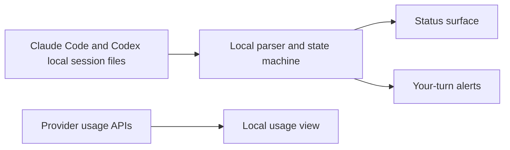

<div align="center">


# Agent Island

**A status companion for Claude Code and Codex.**

See what every run is doing. Step away, and Agent Island calls you back when it is your turn. Monitoring stays on your machine, with no Agent Island account and no product telemetry.

**[agent-island.dev](https://agent-island.dev)** · [简体中文](README.zh-CN.md)

[](https://github.com/tristan666666/agent-island/releases/latest)
[](#macos-and-windows)
[](LICENSE)

<!-- Core README demo placeholder: add the 8-12 second running -> your turn -> open session loop here. -->

[Get started](#quick-start) · [How it works](#how-it-works) · [Latest release](https://github.com/tristan666666/agent-island/releases/latest) · [Contribute](#contributing)

</div>

## Why Agent Island

Long-running coding agents should not require a wall of terminals to stay in view. Agent Island gives you a small, persistent status surface for Claude Code and Codex, so you can see what is working, what needs attention, and when a run has handed control back to you.

It is built for developers who:

- run more than one coding-agent session at a time;
- leave long tasks running while they work elsewhere;
- want status and alerts without sending session data to another product.

## Quick Start

Download the current `v1.6.1` package from the latest release:

- **macOS 13 or later:** [AgentIsland-1.6.1.dmg](https://github.com/tristan666666/agent-island/releases/download/v1.6.1/AgentIsland-1.6.1.dmg)
- **Windows 10/11 x64:** [AgentIsland-1.6.1-win-x64.zip](https://github.com/tristan666666/agent-island/releases/download/v1.6.1/AgentIsland-1.6.1-win-x64.zip)

On macOS, drag AgentIsland to Applications. If Gatekeeper blocks the first launch because the app is not notarized, right-click the app in Finder and choose **Open** once.

On Windows, extract the ZIP and run `AgentIsland.exe`.

Package managers are also available, but their published versions can lag behind the latest GitHub release:

```sh
brew install tristan666666/tap/agentisland
```

```powershell
winget install TristanTang.AgentIsland
```

```powershell
scoop bucket add agent-island https://github.com/tristan666666/scoop-bucket
scoop install agent-island/agentisland
```

## Table of Contents

- [Why Agent Island](#why-agent-island)
- [Quick Start](#quick-start)
- [Know what every run is doing](#know-what-every-run-is-doing)
- [Come back when it is your turn](#come-back-when-it-is-your-turn)
- [Understand usage without uploading sessions](#understand-usage-without-uploading-sessions)
- [macOS and Windows](#macos-and-windows)
- [How it works](#how-it-works)
- [Privacy and safety](#privacy-and-safety)
- [FAQ](#faq)
- [Contributing](#contributing)

## Know what every run is doing

Agent Island turns local session activity into a status you can scan without reopening every terminal.


- A rotating provider logo means a session is working.
- A still logo means no run is active or the turn has returned to you.
- A red pulse means the session needs attention because of an error or provider state.

Session detection is event-driven from the files Claude Code and Codex already maintain on your computer. The app does not need an Agent Island cloud account to watch them.

## Come back when it is your turn

When a background run finishes and hands control back, Agent Island can show an alert, deliver a system notification, and play the sound selected in Settings. Multiple completed runs queue instead of replacing one another.

<table>
  <tr>
    <td align="center"></td>
    <td align="center"></td>
  </tr>
</table>

Use **Open Session** to return to the corresponding run when the installed client and platform support direct session navigation.

## Understand usage without uploading sessions

The usage surface keeps provider windows and local activity context beside session status. Provider usage requests go directly to the provider with credentials already present on your machine; Agent Island does not proxy them through an Agent Island server.


`v1.6.1` also includes locally rendered weekly and monthly report cards. API-value estimates are reference calculations, not provider bills or proof of money saved. See the [v1.6.1 release notes](https://github.com/tristan666666/agent-island/releases/tag/v1.6.1) for the exact shipped scope.

## macOS and Windows

Agent Island ships as native apps for macOS and Windows. The core product scope is the same: local session status, attention signals, and your-turn alerts. The presentation follows each platform: a menu-bar/top-bar experience on macOS and a top bar or movable widget with a tray presence on Windows.

<!-- Platform comparison placeholder: add the verified capability matrix after macOS and Windows behavior QA. -->

<!-- Windows visual evidence placeholder: add real running/waiting, your-turn alert, and usage screenshots here. -->

For current packages and platform-specific notes, use the [latest release](https://github.com/tristan666666/agent-island/releases/latest). Windows contributors can work from the [`windows/`](windows/) project.

## How it works



- **Session state:** local transcript activity and end-of-turn markers feed the local state machine.
- **Attention:** the current state drives the island, notifications, and queued alerts.
- **Usage:** requests go from the app to the provider APIs; they are not sent through an Agent Island backend.
- **Reports:** aggregation and image rendering happen locally, and sharing requires an explicit user action.

Read the engineering note: [How Agent Island detects Claude Code and Codex session state](docs/how-agent-island-detects-session-state.md).

## Privacy and safety

- No Agent Island account is required.
- Agent Island has no product analytics or telemetry endpoint.
- Session monitoring and report generation run locally.
- Provider usage calls use credentials already stored by the provider tools on your computer.
- Report images leave the app only when you explicitly copy or share them.
- macOS builds are ad-hoc signed, not Apple-notarized. Sparkle separately verifies app updates with an EdDSA signature.

## FAQ

### Why not just keep every terminal visible?

You can, but the cost grows with every parallel run. Agent Island provides a persistent summary and calls attention only when a session changes state or needs you.

### Does Agent Island upload my transcripts?

No. Session parsing happens locally. The app calls provider usage endpoints directly for usage information, but it does not send transcripts to Agent Island.

### Why does macOS ask me to open the app manually the first time?

The project does not currently use a paid Apple Developer ID, so the app is not notarized. Right-click the app in Finder and choose **Open** once. Update packages are independently checked with Sparkle's EdDSA signature.

### Can I build it myself?

Yes. For macOS:

```sh
git clone https://github.com/tristan666666/agent-island.git
cd agent-island
./scripts/verify.sh
open build/AgentIsland.app
```

See [`windows/README.md`](windows/README.md) for the Windows project.

## Contributing

Small, verifiable contributions are welcome. Current starting points include:

- [#15 Add a public-copy guard for retired feature claims](https://github.com/tristan666666/agent-island/issues/15)
- [#17 Update GitHub issue forms for the current product scope](https://github.com/tristan666666/agent-island/issues/17)
- [#10 Document the Windows contributor build and test workflow](https://github.com/tristan666666/agent-island/issues/10)

Read [CONTRIBUTING.md](CONTRIBUTING.md) before opening a pull request. Localization issues are also labeled [`good first issue`](https://github.com/tristan666666/agent-island/issues?q=is%3Aissue%20state%3Aopen%20label%3A%22good%20first%20issue%22).

## Roadmap and changelog

- [Roadmap](docs/roadmap.md)
- [Latest release](https://github.com/tristan666666/agent-island/releases/latest)
- [All releases](https://github.com/tristan666666/agent-island/releases)
- [v1.6.1 launch film](docs/media/agentisland-1.6.1-launch-en.mp4)

The launch film is release material for `v1.6.1`; it is not the core status-workflow demo reserved at the top of this README.

## Community and featured listings

[Product Hunt](https://www.producthunt.com/products/agent-island-2) · [Chinese Independent Developer Projects](https://github.com/1c7/chinese-independent-developer) · [awesome-mac](https://github.com/jaywcjlove/awesome-mac) · [awesome-swift-macos-apps](https://github.com/jaywcjlove/awesome-swift-macos-apps)

Chinese-speaking users can also join the [WeChat community](Assets/wechat-qr.jpg).

## Credits and license

Agent Island is a fork of [codex-island](https://github.com/ericjypark/codex-island) by [Eric Park](https://github.com/ericjypark). The original usage-island and cost-tracking foundation is his work. Provider names and marks belong to their respective owners; this project is not affiliated with Anthropic or OpenAI.

Released under the [MIT License](LICENSE). Copyright © 2026 Eric Park; this fork retains the original notice.
