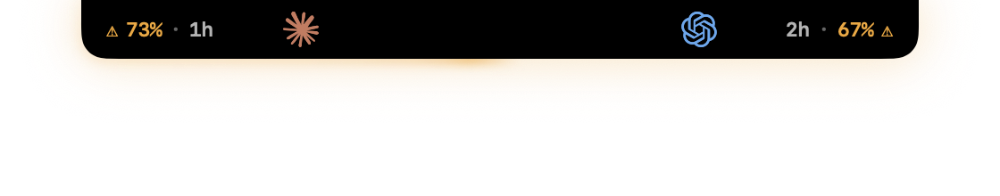
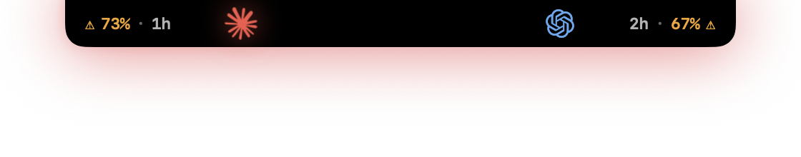
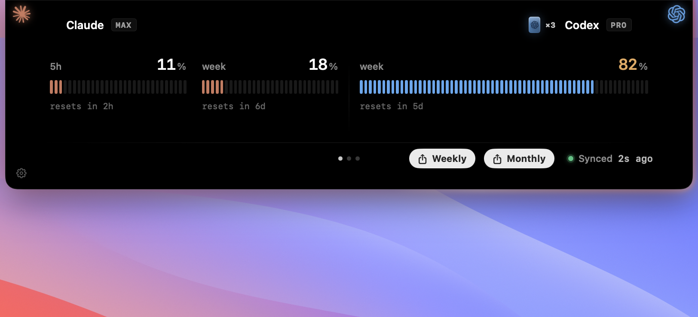
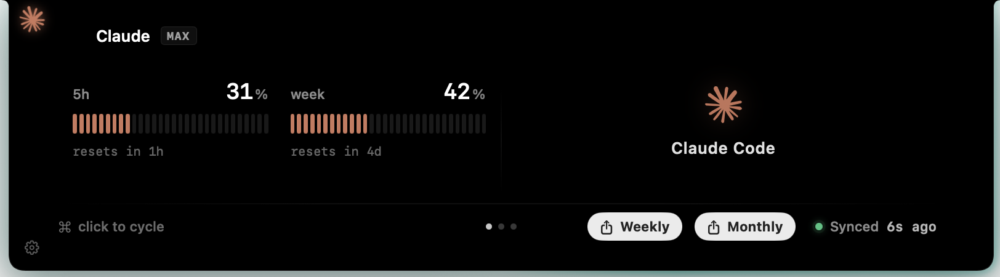
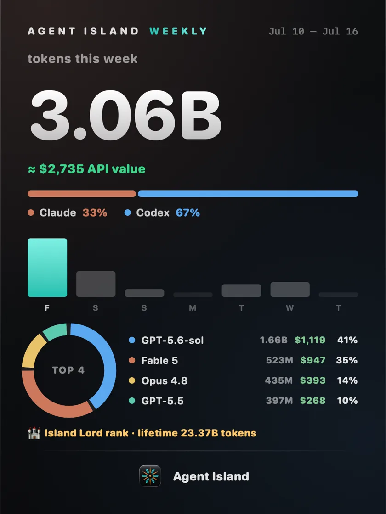
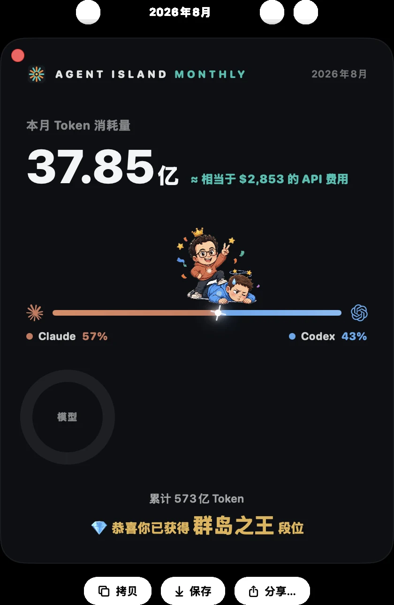
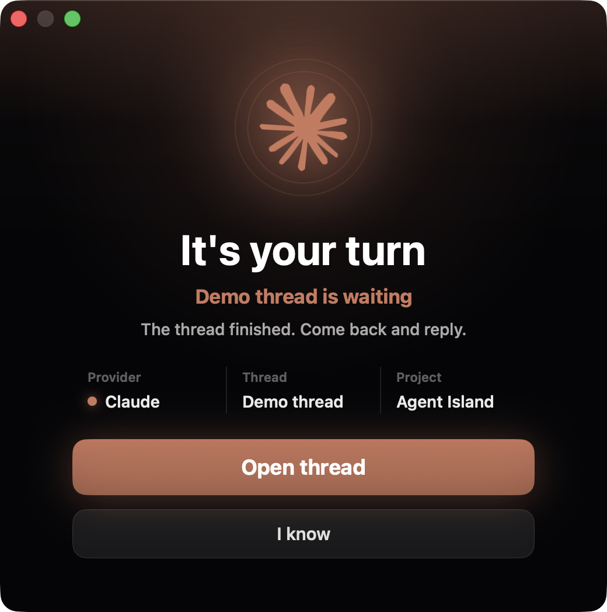
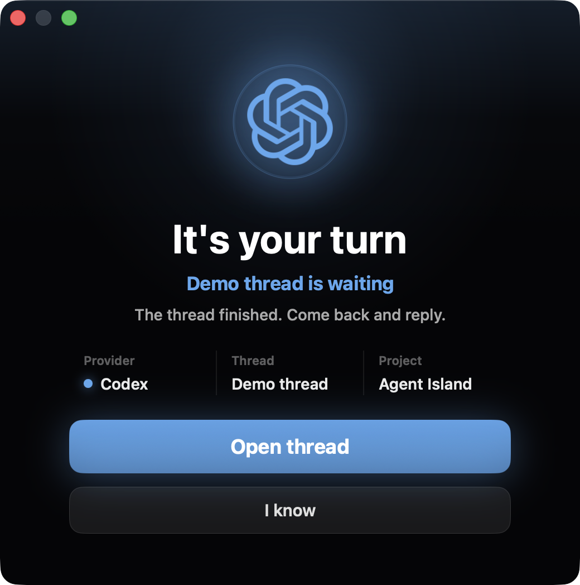
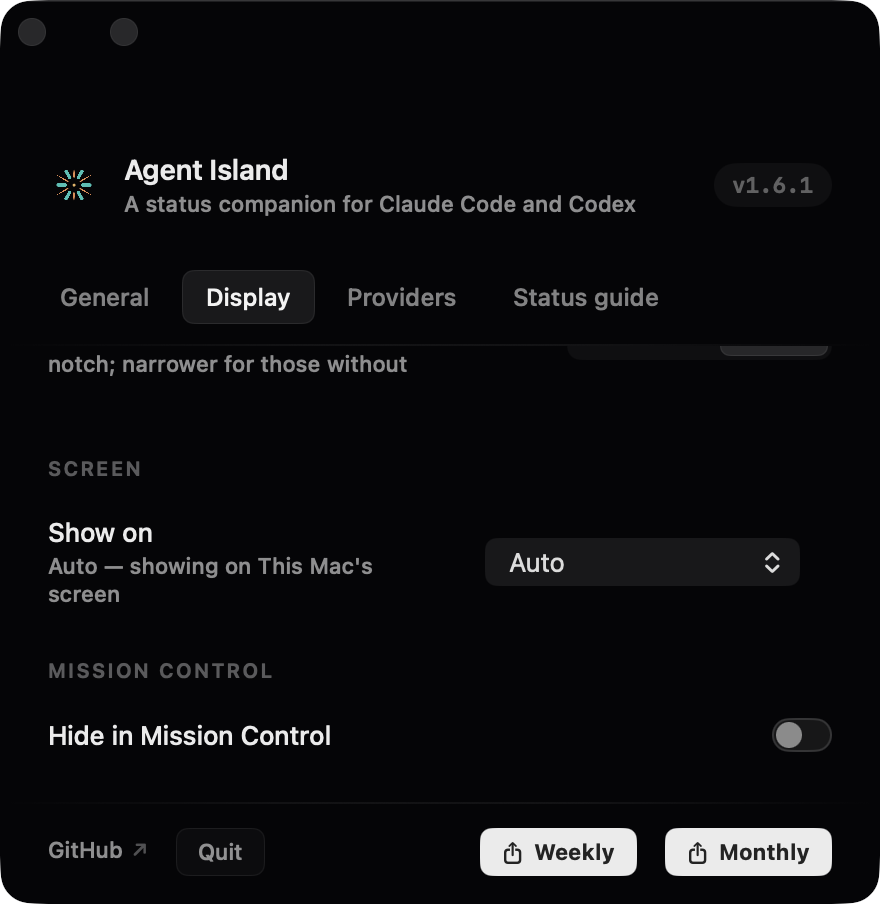
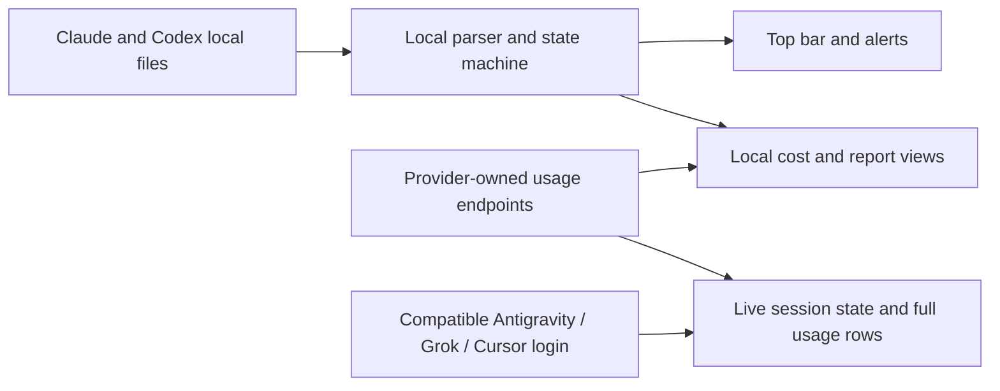

<div align="center">


# Agent Island

**A status companion for your AI coding agents — Claude Code, Codex, Antigravity, Grok, and Cursor.**

See what every run is doing. Step away, and Agent Island calls you back when it is your turn. Local-first, no Agent Island account, no product telemetry.

**[agent-island.dev](https://agent-island.dev)** · [简体中文](README.zh-CN.md)

[](https://github.com/tristan666666/agent-island/releases/latest)
[](https://github.com/tristan666666/agent-island/releases)
[](#macos-and-windows)
[](https://github.com/tristan666666/agent-island/actions)
[](LICENSE)

[](https://github.com/jaywcjlove/awesome-mac/blob/master/README.md#menu-bar-tools)
[](https://github.com/jaywcjlove/awesome-swift-macos-apps/blob/main/README.md#ai)
[](https://github.com/milisp/awesome-codex-cli)
[](https://github.com/kailiu42/awesome-coding-agents)
[](https://github.com/GetBindu/awesome-claude-code-and-skills)
[](https://github.com/acvnace/awesome-vibe-coding-resources#desktop-apps)
[](https://github.com/roboco-io/awesome-vibecoding#projects-platforms--tools)
[](https://github.com/1c7/chinese-independent-developer/pull/1085/files)

<a href="https://www.producthunt.com/products/agent-island-2?embed=true&utm_source=badge-featured&utm_medium=badge&utm_campaign=badge-agent-island-2">
  
</a>


<sub><a href="https://github.com/tristan666666/agent-island/blob/main/docs/media/agentisland-1.7.1-launch-en.mp4">▶&nbsp;HD version</a></sub>

<!-- Swap the launch film above for the 8-12 second product demo loop (running -> your turn -> open session) once it exists. -->

<p>
  <a href="#quick-start"><strong>Quick Start</strong></a> ·
  <a href="https://github.com/tristan666666/agent-island/releases/latest">Download</a> ·
  <a href="https://agent-island.dev">Website</a> ·
  <a href="docs/how-agent-island-detects-session-state.md">How it works</a> ·
  <a href="CONTRIBUTING.md">Contribute</a>
</p>

</div>

## Quick Start

Choose your platform and install the current release directly:

> `v2.1.2` is live on macOS — five providers, island-wide session status, and the rewritten settings panel. **The Windows build syncs to 2.1.2 shortly**; its download below is the v1.7.1 build until then.

| Platform | Recommended download | Requirement |
|---|---|---|
| macOS | [AgentIsland-2.1.2.dmg](https://github.com/tristan666666/agent-island/releases/download/v2.1.2/AgentIsland-2.1.2.dmg) | macOS 13+, Apple silicon or Intel |
| Windows | [AgentIsland-1.7.1-win-x64.zip](https://github.com/tristan666666/agent-island/releases/download/v1.7.1/AgentIsland-1.7.1-win-x64.zip) | Windows 10/11 x64 — syncs to 2.1.2 shortly |

On macOS, drag Agent Island into Applications. The app is ad-hoc signed rather than notarized, so the first launch requires right-clicking the app in Finder and choosing **Open**.

On Windows, unzip the archive and run `AgentIsland.exe`.

> **First launch on macOS** (manual download only): Gatekeeper shows "Apple could not verify AgentIsland" because the app ships without a paid Apple Developer certificate — it is ad-hoc signed, and update integrity is handled by Sparkle's own EdDSA signatures instead. Right-click the app and choose Open, or approve it under System Settings → Privacy & Security → Open Anyway. Homebrew installs skip this entirely.

<details>
<summary>Package managers and source builds</summary>

Homebrew, WinGet, and Scoop may lag behind the latest GitHub release. Check the version they offer before installing.

```sh
brew install tristan666666/tap/agentisland
```

```powershell
winget install TristanTang.AgentIsland
```

```powershell
scoop bucket add agent-island https://github.com/tristan666666/scoop-bucket
scoop install agent-island/agentisland
```

Build the macOS app from source:

```sh
git clone https://github.com/tristan666666/agent-island.git
cd agent-island
./scripts/verify.sh
open build/AgentIsland.app
```

Windows build and test instructions are tracked in [issue #10](https://github.com/tristan666666/agent-island/issues/10).

</details>

## Table of Contents

- [Features](#features)
  - [Status monitoring](#status-monitoring)
  - [Usage](#usage)
  - [Weekly & monthly report cards](#weekly--monthly-report-cards)
  - [It's-your-turn clock](#its-your-turn-clock)
  - [Personalization](#personalization)
  - [macOS and Windows](#macos-and-windows)
- [Community](#community)
- [How it works](#how-it-works)
- [Why Agent Island](#why-agent-island)
- [Privacy and safety](#privacy-and-safety)
- [FAQ](#faq)
- [Contributing](#contributing)
- [Roadmap and releases](#roadmap-and-releases)
- [Credits and license](#credits-and-license)

## Features

### Status monitoring

Agent Island mirrors local session activity from Claude Code, Claude Desktop, Codex, Grok, Antigravity, and Cursor in a compact top bar. You can scan the state without bringing each session to the foreground — the two states below sit one hover apart:





| Cue | Meaning |
|---|---|
| Logo rotates | A session is working |
| Logo is still | No session is currently working |
| Logo pulses red | A session needs attention because of a provider, login, network, or rate-limit error |

### Usage

Choose up to two compact-island slots from Claude, Codex, Antigravity, Grok, and Cursor. Live session state (working / stalled / your turn) covers all five; every selected provider keeps a full usage row with model or product breakdowns on hover and a click-through to its official page. Compatible local sign-in is required; no detected login means no slot or row.

Cost, calendar, and report summaries are calculated locally from session records. Provider quota and reset data comes from provider-owned endpoints through the local credential store.

Codex machines with more than one account can park each login under a name and switch from the provider menu — with an opt-in auto-switch that rotates to the next parked account when the active quota reads exhausted, driven by real usage numbers.



Machines with a single subscription get the solo layout automatically — the provider's mark and name hold one half of the panel, the live windows the other:



### Weekly & monthly report cards

Shareable cards rendered locally: total tokens with an ≈ API value line, a faction duel whose clash sits exactly at your usage split (the leading side wins the crown), 7-day bars with a model donut, every model that ran listed, and your island rank as the closing line. Both cards accept any start date from a calendar picker. Copying or sharing a card is an explicit user action; Agent Island does not publish it for you.

<table>
  <tr>
    <td align="center"><br><sub>English · Claude wins the week</sub></td>
    <td align="center"><br><sub>简体中文 · Codex wins the month</sub></td>
  </tr>
</table>

### It's-your-turn clock

When a background turn finishes, Agent Island can show an alarm window, send a system notification, and play a sound. Multiple completed turns queue instead of replacing one another, and responding clears the corresponding reminder. If you are already looking at the session's terminal or editor, the alarm holds — it fires the moment you switch away with the turn still open.

<table>
  <tr>
    <td align="center"></td>
    <td align="center"></td>
  </tr>
</table>

### Personalization

The island is yours to tune from a settings panel rebuilt in 2.1.2 — sidebar navigation, teal-for-data / gold-for-selection color language, and micro-motion on every control. Usage tiles come in five chart styles with a used-or-remaining quota toggle and cycling cost styles. The ambient light runs **Vivid** — halo and orbit sweep in your pick of teal, cobalt, violet, or silver — or fully-dark **Calm**, which saves color for real warnings. Screens without a notch get a 100–150% interface scale.



### macOS and Windows

Agent Island is a native desktop app on both supported platforms, with English and Simplified Chinese interfaces.

- **macOS 13+**: SwiftUI universal app for Apple silicon and Intel, with wide and compact top-bar layouts.
- **Windows 10/11 x64**: native WPF app with a top bar, draggable floating widget, and tray presence.

<!-- WINDOWS_SCREENSHOTS_PLACEHOLDER
Add verified Windows screenshots here only after capture and release-behavior review:
1. running / waiting top bar or floating widget;
2. your-turn alert;
3. usage or report view.
-->

<!-- PLATFORM_CAPABILITY_MATRIX_PLACEHOLDER
Add the macOS / Windows capability matrix only after the current release has been verified on both platforms.
Do not infer parity from release notes or CI alone.
-->

## Community

Chinese-speaking users — scan the group QR to join directly. Group codes rotate every 7 days; if it has expired, add the author and mention "Agent Island" to be invited:

<table>
  <tr>
    <td align="center">
      <br>
      <sub>WeChat group — scan to join</sub>
    </td>
    <td align="center">
      <br>
      <sub>Group code expired? Add the author, mention "Agent Island"</sub>
    </td>
  </tr>
</table>

See Agent Island on [Product Hunt](https://www.producthunt.com/products/agent-island-2).

## How it works



- **Session state** comes only from the transcript and activity files that Claude Code, Claude Desktop, Codex, Grok, Antigravity, and Cursor already write to disk. Local file events and turn markers drive the working and needs-you states across all five providers; each one is read from its own records rather than a shared guess.
- **Usage and reset data** comes from provider-owned usage endpoints through the local credential store, for every provider with a compatible local sign-in.
- **Cost, model, and report summaries** are calculated locally from local session records.

Read the implementation overview: [How Agent Island detects Claude Code and Codex session state](docs/how-agent-island-detects-session-state.md).

## Why Agent Island

Long agent runs should not require keeping every terminal in view. Agent Island gives those sessions a persistent live-status surface, tells you when a run needs attention, and brings you back when the next action is yours — across Claude Code, Codex, Antigravity, Grok, and Cursor.

It is built for developers who:

- run several agents in parallel — Claude Code, Codex, Grok, Antigravity, Cursor — and keep every quota in the same compact island;
- leave long tasks working in the background;
- want status, alerts, usage views, and shareable report cards without sending session data to another service;
- care what their desk looks like — the island's light, layout, and cards are tuned like a product, not a debug overlay.

How it compares with its neighbors:

| | Agent Island | [Vibe Island](https://vibeisland.app) | [CodexBar](https://github.com/steipete/CodexBar) | [ccusage](https://github.com/ccusage/ccusage) | [Claude Code Usage Monitor](https://github.com/Maciek-roboblog/Claude-Code-Usage-Monitor) | [CCSeva](https://github.com/Iamshankhadeep/ccseva) | [codex-island](https://github.com/ericjypark/codex-island) |
|---|---|---|---|---|---|---|---|
| Price & source | Free · MIT | One-time purchase · closed | Free · MIT | Free · MIT | Free · MIT | Free · MIT | Free · MIT |
| Form | Menu-bar app | Notch app | Menu-bar app | CLI | Terminal dashboard | Menu-bar app | Menu-bar app |
| Platforms | macOS 13+ · Windows 10/11 | macOS 14+ | macOS 14+ (CLI also on Linux) | Anywhere Node runs | Anywhere Python runs | macOS | macOS |
| Agents | Claude Code · Codex · Grok · Antigravity · Cursor (all live sessions) | Claude Code, Codex, Gemini CLI, Cursor, and more | 59 providers (limits) | Claude Code (+ Codex) | Claude Code | Claude Code | Codex (+ Claude usage) |
| Live session status | ✓ Claude · Codex · Grok · Antigravity · Cursor | ✓ | — (provider incident badges) | — | — | — | — (passive usage meter) |
| Your-turn alarm window + sound + queue | ✓ | Done notice, click to jump | — | — | — | — | — |
| Out-of-quota alarm | ✓ | — | — | — | Terminal warnings | 70/90% threshold notifications | — |
| In-notch permission approvals | — | ✓ | — | — | — | — | — |
| Usage, cost & resets | ✓ all five (windows · cost · reset countdowns) | Usage windows | ✓ (59 providers, reset countdowns, spend) | ✓ (local cost reports) | ✓ (real-time + predictions) | ✓ (5h/weekly gauges + countdowns) | ✓ (incl. reset credits) |
| Weekly/monthly report cards & ranks | ✓ | — | — | — | — | — | — |

<sub>Based on each product's public materials as of July 2026 — corrections welcome via issue.</sub>

## Privacy and safety

- No Agent Island account is required.
- Session data is not uploaded to Agent Island.
- The app has no product telemetry.
- Usage and authentication calls go directly to provider-owned endpoints through the local credential store.
- If you use Claude re-authentication, Agent Island may refresh and update credentials shared with Claude Code or Claude Desktop in that local store.
- macOS updates are verified by Sparkle with an EdDSA signature before installation.

Agent Island reads the local files and credentials required to provide these views. Review the source and release artifacts before installing, as you would for any local developer tool.

## FAQ

<details>
<summary><strong>Why is the macOS app not notarized?</strong></summary>

The project does not currently use a paid Apple Developer account. The macOS build is ad-hoc signed, so the first launch requires right-clicking Agent Island in Finder and choosing **Open**. Sparkle independently verifies update signatures before installation.

</details>

<details>
<summary><strong>Does session data leave my computer?</strong></summary>

Session state, cost calculations, and reports are derived locally. Agent Island does not upload session data or collect product telemetry. Usage views call provider-owned endpoints through the local credential store. Claude re-authentication may refresh and update credentials shared with Claude Code or Claude Desktop in that store.

</details>

<details>
<summary><strong>How is this different from codex-island?</strong></summary>

[codex-island](https://github.com/ericjypark/codex-island) established the usage-island and cost-tracking foundation. Agent Island builds on it with live session state, your-turn alerts, Windows support, and a broader desktop workflow.

</details>

## Contributing

Contributions are welcome across macOS, Windows, documentation, tests, and localization. Start with [CONTRIBUTING.md](CONTRIBUTING.md) and the [Code of Conduct](CODE_OF_CONDUCT.md).

Current good first issues:

- [#10: Document the Windows contributor build and test workflow](https://github.com/tristan666666/agent-island/issues/10)
- [#11: Add a localization key parity check](https://github.com/tristan666666/agent-island/issues/11)
- [#15: Add a public-copy guard for retired feature claims](https://github.com/tristan666666/agent-island/issues/15)

Run `./scripts/verify.sh` before opening a macOS pull request. Windows changes are checked by the repository's Windows CI workflow.

## Roadmap and releases

- [Latest release](https://github.com/tristan666666/agent-island/releases/latest)
- [Roadmap](docs/roadmap.md)
- [Open issues](https://github.com/tristan666666/agent-island/issues)

## Credits and license

Agent Island is a fork of **[codex-island](https://github.com/ericjypark/codex-island)** by **Eric Park**. The original usage-island and cost-tracking foundation are his work. Agent Island adds live session-state views, your-turn alerts, cross-platform support, and its own product direction.

MIT licensed. Copyright 2026 Eric Park. This fork retains the original notice. See [LICENSE](LICENSE).
