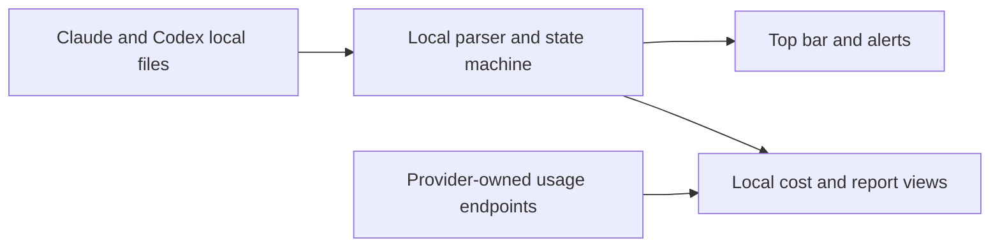

<div align="center">


# Agent Island

**A status companion for Claude Code and Codex.**

See what every run is doing. Step away, and Agent Island calls you back when it is your turn. Local-first, no Agent Island account, no product telemetry.

**[agent-island.dev](https://agent-island.dev)** · [简体中文](README.zh-CN.md)

[](https://github.com/tristan666666/agent-island/releases/latest)
[](#macos-and-windows)
[](LICENSE)

<!-- README_CORE_DEMO_PLACEHOLDER
Replace this comment with the approved 8-12 second, seamless running -> your turn -> open session demo.
Do not restore docs/media/launch.gif here: it is a release film, not the core product demo.
-->

<p>
  <a href="#quick-start"><strong>Quick Start</strong></a> ·
  <a href="https://github.com/tristan666666/agent-island/releases/latest">Download</a> ·
  <a href="https://agent-island.dev">Website</a> ·
  <a href="docs/how-agent-island-detects-session-state.md">How it works</a> ·
  <a href="CONTRIBUTING.md">Contribute</a>
</p>

</div>

## Quick Start

Choose your platform and install the current `v1.6.1` release directly:

| Platform | Recommended download | Requirement |
|---|---|---|
| macOS | [AgentIsland-1.6.1.dmg](https://github.com/tristan666666/agent-island/releases/download/v1.6.1/AgentIsland-1.6.1.dmg) | macOS 13+, Apple silicon or Intel |
| Windows | [AgentIsland-1.6.1-win-x64.zip](https://github.com/tristan666666/agent-island/releases/download/v1.6.1/AgentIsland-1.6.1-win-x64.zip) | Windows 10/11 x64 |

On macOS, drag Agent Island into Applications. The app is ad-hoc signed rather than notarized, so the first launch requires right-clicking the app in Finder and choosing **Open**.

On Windows, unzip the archive and run `AgentIsland.exe`.

<details>
<summary>Package managers and source builds</summary>

Homebrew, WinGet, and Scoop may lag behind the latest GitHub release. Check the version they offer before installing.

```sh
brew install tristan666666/tap/agentisland
```

```powershell
winget install TristanTang.AgentIsland
```

```powershell
scoop bucket add agent-island https://github.com/tristan666666/scoop-bucket
scoop install agent-island/agentisland
```

Build the macOS app from source:

```sh
git clone https://github.com/tristan666666/agent-island.git
cd agent-island
./scripts/verify.sh
open build/AgentIsland.app
```

Windows build and test instructions are tracked in [issue #10](https://github.com/tristan666666/agent-island/issues/10).

</details>

## Table of Contents

- [Why Agent Island](#why-agent-island)
- [Status monitoring](#status-monitoring)
- [It's-your-turn clock](#its-your-turn-clock)
- [Usage & reports](#usage--reports)
- [macOS and Windows](#macos-and-windows)
- [How it works](#how-it-works)
- [Privacy and safety](#privacy-and-safety)
- [FAQ](#faq)
- [Contributing](#contributing)
- [Roadmap and releases](#roadmap-and-releases)
- [Community and featured listings](#community-and-featured-listings)

## Why Agent Island

Long Claude Code and Codex runs should not require keeping every terminal in view. Agent Island gives each provider a persistent status surface, tells you when a run needs attention, and brings you back when the next action is yours.

It is built for developers who:

- run Claude Code and Codex sessions in parallel;
- leave long tasks working in the background;
- want status, alerts, and usage views without sending session data to another service.

## Status monitoring

Agent Island mirrors local Claude Code, Claude Desktop, and Codex session activity in a compact top bar. You can scan the state without bringing each session to the foreground.


| Cue | Meaning |
|---|---|
| Logo rotates | A session is working |
| Logo is still | No session is currently working |
| Logo pulses red | A session needs attention because of a provider, login, network, or rate-limit error |


## It's-your-turn clock

When a background turn finishes, Agent Island can show an alarm window, send a system notification, and play a sound. Multiple completed turns queue instead of replacing one another, and responding clears the corresponding reminder.

<table>
  <tr>
    <td align="center"></td>
    <td align="center"></td>
  </tr>
</table>

## Usage & reports

Swipe through local usage and cost views for Claude and Codex. Provider usage data comes from provider-owned usage endpoints through the local credential store; cost and model summaries are calculated locally from session records.


Agent Island also renders weekly and longer-range report cards on your machine. Copying or sharing a card is an explicit user action; Agent Island does not publish it for you.

<!-- OPTIMIZED_REPORT_SCREENSHOTS_PLACEHOLDER
Add README-sized WebP report examples here after export and visual review.
Do not restore the multi-megabyte PNG pair to the README.
-->

## macOS and Windows

Agent Island is a native desktop app on both supported platforms, with English and Simplified Chinese interfaces.

- **macOS 13+**: SwiftUI universal app for Apple silicon and Intel, with wide and compact top-bar layouts.
- **Windows 10/11 x64**: native WPF app with a top bar, draggable floating widget, and tray presence.

<!-- WINDOWS_SCREENSHOTS_PLACEHOLDER
Add verified Windows screenshots here only after capture and release-behavior review:
1. running / waiting top bar or floating widget;
2. your-turn alert;
3. usage or report view.
-->

<!-- PLATFORM_CAPABILITY_MATRIX_PLACEHOLDER
Add the macOS / Windows capability matrix only after the current release has been verified on both platforms.
Do not infer parity from release notes or CI alone.
-->

## How it works



- **Session state** comes from transcript and activity files that Claude Code, Claude Desktop, and Codex already write to disk. Local file events and turn markers drive the working and needs-you states.
- **Usage and reset data** comes from provider-owned usage endpoints through the local credential store.
- **Cost, model, and report summaries** are calculated locally from local session records.

Read the implementation overview: [How Agent Island detects Claude Code and Codex session state](docs/how-agent-island-detects-session-state.md).

## Privacy and safety

- No Agent Island account is required.
- Session data is not uploaded to Agent Island.
- The app has no product telemetry.
- Usage and authentication calls go directly to provider-owned endpoints through the local credential store.
- If you use Claude re-authentication, Agent Island may refresh and update credentials shared with Claude Code or Claude Desktop in that local store.
- macOS updates are verified by Sparkle with an EdDSA signature before installation.

Agent Island reads the local files and credentials required to provide these views. Review the source and release artifacts before installing, as you would for any local developer tool.

## FAQ

<details>
<summary><strong>Why is the macOS app not notarized?</strong></summary>

The project does not currently use a paid Apple Developer account. The macOS build is ad-hoc signed, so the first launch requires right-clicking Agent Island in Finder and choosing **Open**. Sparkle independently verifies update signatures before installation.

</details>

<details>
<summary><strong>Does session data leave my computer?</strong></summary>

Session state, cost calculations, and reports are derived locally. Agent Island does not upload session data or collect product telemetry. Usage views call provider-owned endpoints through the local credential store. Claude re-authentication may refresh and update credentials shared with Claude Code or Claude Desktop in that store.

</details>

<details>
<summary><strong>How is this different from codex-island?</strong></summary>

[codex-island](https://github.com/ericjypark/codex-island) established the usage-island and cost-tracking foundation. Agent Island builds on it with live session state, your-turn alerts, Windows support, and a broader desktop workflow.

</details>

## Contributing

Contributions are welcome across macOS, Windows, documentation, tests, and localization. Start with [CONTRIBUTING.md](CONTRIBUTING.md) and the [Code of Conduct](CODE_OF_CONDUCT.md).

Current good first issues:

- [#10: Document the Windows contributor build and test workflow](https://github.com/tristan666666/agent-island/issues/10)
- [#11: Add a localization key parity check](https://github.com/tristan666666/agent-island/issues/11)
- [#15: Add a public-copy guard for retired feature claims](https://github.com/tristan666666/agent-island/issues/15)

Run `./scripts/verify.sh` before opening a macOS pull request. Windows changes are checked by the repository's Windows CI workflow.

## Roadmap and releases

- [Latest release](https://github.com/tristan666666/agent-island/releases/latest)
- [Roadmap](docs/roadmap.md)
- [Open issues](https://github.com/tristan666666/agent-island/issues)

## Community and featured listings

Chinese-speaking users can join the WeChat community:


Featured in [Chinese Independent Developer Projects](https://github.com/1c7/chinese-independent-developer), [awesome-swift-macos-apps](https://github.com/jaywcjlove/awesome-swift-macos-apps#ai), and [awesome-vibecoding](https://github.com/roboco-io/awesome-vibecoding#projects-platforms--tools).

See Agent Island on [Product Hunt](https://www.producthunt.com/products/agent-island-2).

## Credits and license

Agent Island is a fork of **[codex-island](https://github.com/ericjypark/codex-island)** by **Eric Park**. The original usage-island and cost-tracking foundation are his work. Agent Island adds live session-state views, your-turn alerts, cross-platform support, and its own product direction.

MIT licensed. Copyright 2026 Eric Park. This fork retains the original notice. See [LICENSE](LICENSE).
