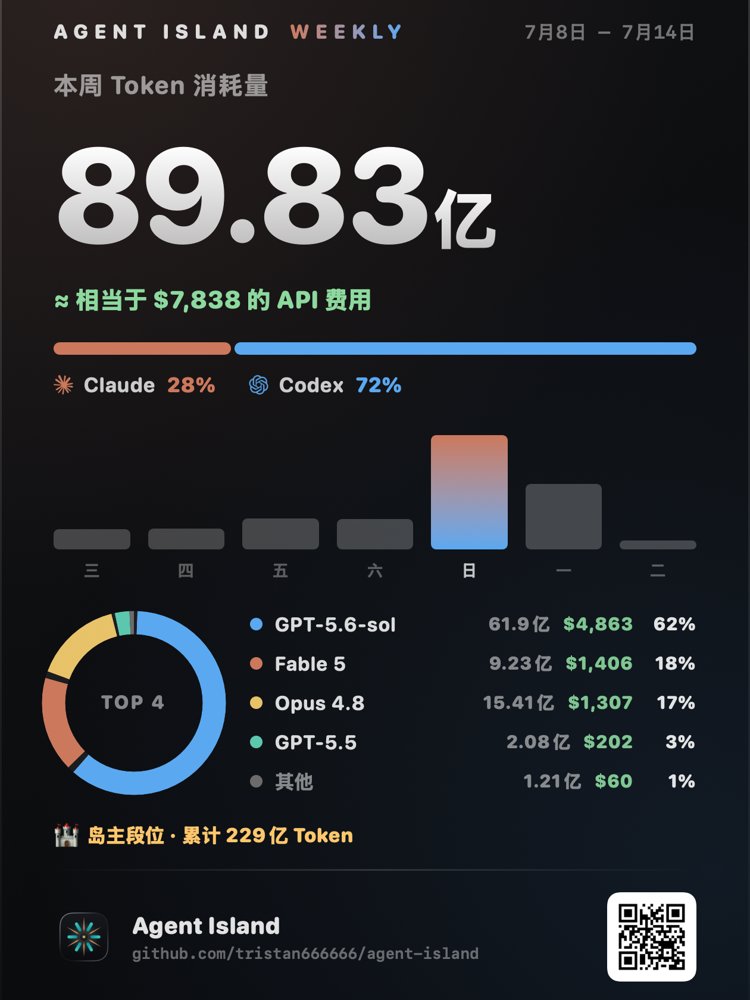
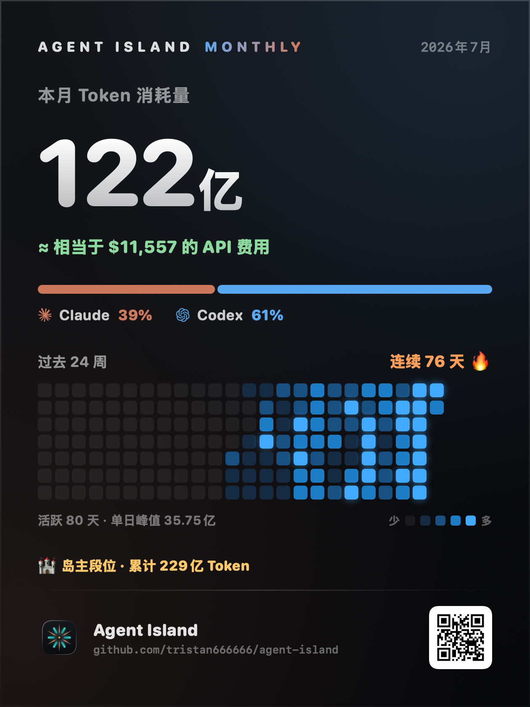
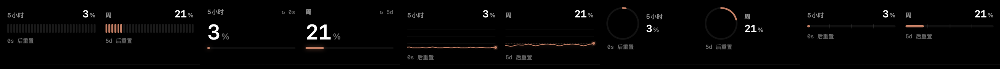

<div align="center">


# Agent Island

**Claude Code 和 Codex 的状态伴侣——常驻你的刘海。**

**[agent-island.dev](https://agent-island.dev/zh/)** · [English](README.md)

[](https://github.com/tristan666666/agent-island/releases/latest)
[](https://github.com/tristan666666/agent-island/releases)
[](https://github.com/tristan666666/agent-island/releases/latest)
[](https://github.com/tristan666666/agent-island/releases/latest)
[](LICENSE)

[](https://github.com/1c7/chinese-independent-developer#tristan-tang---github)
[](https://github.com/jaywcjlove/awesome-mac/blob/master/README-zh.md#%E8%8F%9C%E5%8D%95%E6%A0%8F%E5%B7%A5%E5%85%B7)
[](https://github.com/jaywcjlove/awesome-swift-macos-apps/blob/main/README.md#ai)
[](https://github.com/milisp/awesome-codex-cli)
[](https://github.com/kailiu42/awesome-coding-agents)
[](https://github.com/GetBindu/awesome-claude-code-and-skills)
[](https://github.com/acvnace/awesome-vibe-coding-resources#desktop-apps)

<a href="https://www.producthunt.com/products/agent-island-2?embed=true&utm_source=badge-featured&utm_medium=badge&utm_campaign=badge-agent-island-2">
  
</a>


<sub><a href="https://github.com/tristan666666/agent-island/blob/main/docs/media/agentisland-1.6.1-launch-en.mp4">▶&nbsp;高清版</a></sub>

<p>
  <a href="#安装"><strong>安装</strong></a> ·
  <a href="https://agent-island.dev/zh/">官网</a> ·
  <a href="https://github.com/tristan666666/agent-island/releases/latest">最新 release</a> ·
  <a href="docs/roadmap.md">路线图</a> ·
  <a href="CONTRIBUTING.md">参与贡献</a>
</p>

<p><strong>如果 Agent Island 让你少守一次半夜卡住的 Claude/Codex 任务，给它一个 Star，让更多在 Mac 和 Windows 上跑这些 agent 的人找到它。</strong></p>

</div>

## 安装

```sh
brew install tristan666666/tap/agentisland
```

**Windows**(新):

从 [最新 Release](https://github.com/tristan666666/agent-island/releases/latest) 下载 `AgentIsland-win-x64.zip`,解压运行 `AgentIsland.exe`。

或用 Scoop:

```powershell
scoop bucket add agent-island https://github.com/tristan666666/scoop-bucket
scoop install agent-island/agentisland
```

或用 winget:

```powershell
winget install TristanTang.AgentIsland
```

或直接下载 DMG:

下载 DMG，把 AgentIsland 拖进 Applications，打开：

[**下载最新版 AgentIsland.dmg**](https://github.com/tristan666666/agent-island/releases/latest)

如果 macOS 第一次启动时提示应用未公证，在 Finder 里右键 AgentIsland，选择一次 **打开** 即可。

或者源码构建：

```sh
git clone https://github.com/tristan666666/agent-island.git
cd agent-island
./scripts/verify.sh
open build/AgentIsland.app
```

## 功能

### 🖥️ 一个应用，macOS 和 Windows 原生

同一个产品、同一套检测引擎，双端都无 Electron。中英双语，设置里即切。

- **macOS 13+**（SwiftUI，通用二进制）：刘海机用宽版顶部条，其余设备用紧凑顶部条。
- **Windows 10/11**（WPF）：顶部条或可拖动悬浮小窗，托盘图标常显用量环。

### ⚡ 顶部条上的实时状态


Claude 和 Codex 的 logo 跟着会话的真实状态动。检测是事件驱动的（FSEvents 监听本地记录文件），所以旋转的起停和真实运行只差一秒上下 —— 不是轮询式的延迟。

| 表现 | 含义 |
|---|---|
| logo **旋转** | 有会话正在跑 |
| logo **静止** | 没有任务在跑 —— 或者这一轮结束，该你了 |
| logo **红色脉冲** | 需要处理：限流、登录、网络或服务方异常 |


### 📊 用量岛

Claude 的 5 小时与周用量、Codex 的周用量，以及双家的成本与重置倒计时 —— 刘海里左右滑动的几页，数据来自各家自己的用量 API。当 Claude 的接口要求重新登录时，「重新认证」按钮直接在浏览器里完成（真正的 claude.com 授权页，一次点击，本地回调接住）—— 不开终端、不贴验证码。


**重置卡（Reset bank）**：Codex 的 ×N 徽标显示你囤的重置卡，点开看每张的到期时间。

### 🏆 周报 / 月报战绩卡 —— 1.6.1 新增

一键把你的一周（或半年）渲染成一张可分享的卡片：Token 总量与「≈ API 费用」、Claude/Codex 占比、TOP-5 模型明细（用量 · 花费 · 占比）、24 周活跃热力图与连击天数——还有你的**岛民段位**：从 🌊 漂流者（1 亿）到 👑 传奇航海家（1000 亿）共七级。全部在本机渲染，图片由你自己复制、自己发。

<table>
  <tr>
    <td align="center"></td>
    <td align="center"></td>
  </tr>
</table>

### 🔔 到你回复提醒

后台会话一轮跑完，闹钟窗口 + 系统通知 + 提示音，几秒内送达。

- **回复了就自动消失**；多个完成会排队，不互吞。
- **额度也算数** —— Claude 额度打满时单独提醒一次，写明真实恢复时间。

<table>
  <tr>
    <td align="center"></td>
    <td align="center"></td>
  </tr>
</table>

### 🎨 顺带一提：五种表盘

⌘ 点击小岛即可轮换图表样式，已用 / 剩余随手切。



## 原理

- **会话状态**读自 Claude Code / Claude Desktop / Codex 本来就写在你磁盘上的记录文件：FSEvents 监听写入，再结合轮次完成标记（Claude 的 `stop_reason: end_turn`、Codex 的 `task_complete`）和文件活动，判定旋转 / 闹钟 / 红色。
- **用量和重置时间**来自各家真实的用量 API，用的是你机器上已有的凭据。
- 全程在本机以你的身份运行，不上传任何东西。

更完整的实现拆解（英文）：[How Agent Island detects Claude Code and Codex session state](docs/how-agent-island-detects-session-state.md)。

## FAQ 与安全

**为什么应用没有公证（notarize）？**
没有付费的 Apple 开发者账号。应用是 ad-hoc 签名的，所以首次启动 macOS 会拦一次，右键 → 打开即可。自动更新有独立校验：Sparkle 在安装前会验证每个更新包的 EdDSA 签名。

**我的数据会离开这台 Mac 吗？**
不会。Agent Island 读本地记录文件，用你本机已有的 token 调各家用量 API。应用里没有任何遥测。

**跟 codex-island 有什么不一样？**
[codex-island](https://github.com/ericjypark/codex-island) 是个被动电表 —— 告诉你用了多少。Agent Island 保留了这部分（用量、成本、重置），再加上主动的那一半：logo 上的实时会话状态和到你回复提醒。

## 用户交流群

扫码加作者微信,备注「Agent Island」,拉你进开源交流反馈群——聊使用体验、报问题、提想法,欢迎一起参与共建。


## 致谢与许可

Agent Island fork 自 **[codex-island](https://github.com/ericjypark/codex-island)**（作者 **Eric Park**）—— 用量岛与成本统计的底子是他的。Agent Island 在此之上加入到你回复提醒、实时状态动效、跨平台支持，并走出了自己的产品方向。

MIT 许可 —— © 2026 Eric Park，本 fork 保留该声明。见 [LICENSE](LICENSE)。
