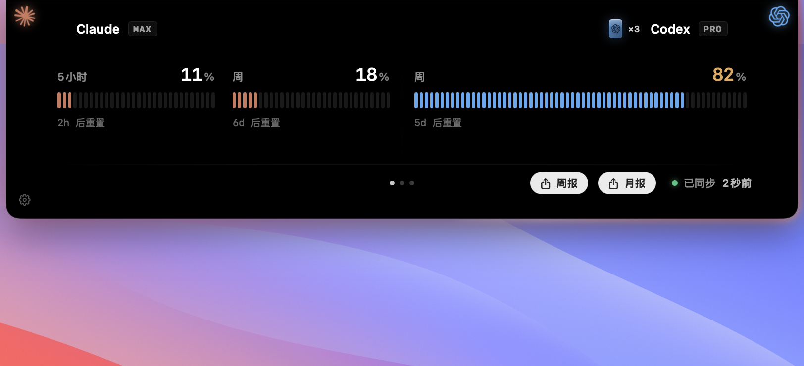
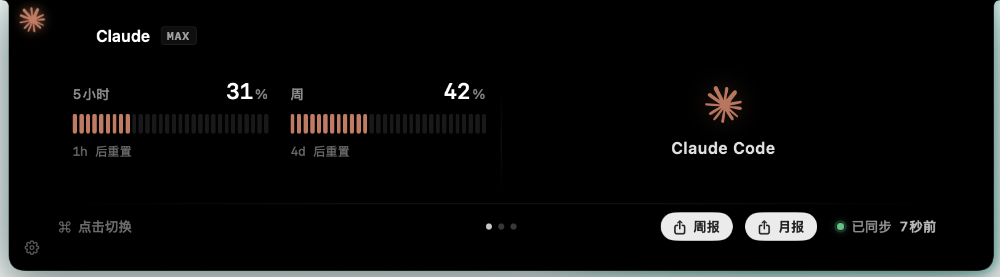
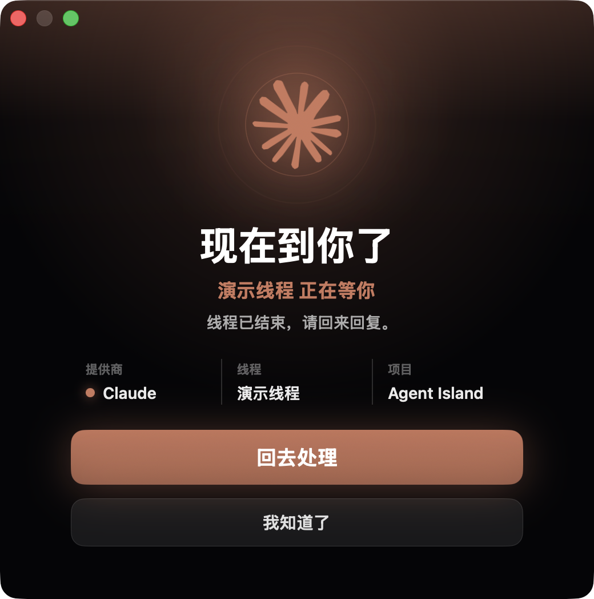
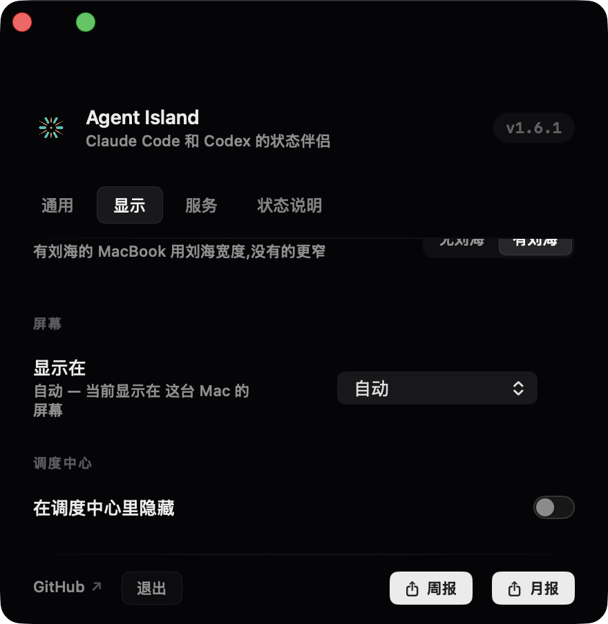
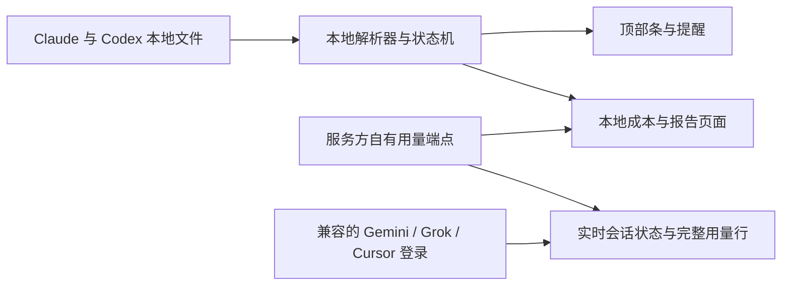

<div align="center">


# Agent Island

**Claude Code、Codex 的实时状态，Gemini、Grok 的额度，一起看。**

随时看清每个任务正在做什么。你可以离开终端，轮到你时 Agent Island 会叫你回来。本地优先、无需 Agent Island 账号、无产品遥测。

**[agent-island.dev](https://agent-island.dev/zh/)** · [English](README.md)

[](https://github.com/tristan666666/agent-island/releases/latest)
[](https://github.com/tristan666666/agent-island/releases)
[](#macos-和-windows)
[](https://github.com/tristan666666/agent-island/actions)
[](LICENSE)

[](https://github.com/jaywcjlove/awesome-mac/blob/master/README.md#menu-bar-tools)
[](https://github.com/jaywcjlove/awesome-swift-macos-apps/blob/main/README.md#ai)
[](https://github.com/milisp/awesome-codex-cli)
[](https://github.com/kailiu42/awesome-coding-agents)
[](https://github.com/GetBindu/awesome-claude-code-and-skills)
[](https://github.com/acvnace/awesome-vibe-coding-resources#desktop-apps)
[](https://github.com/roboco-io/awesome-vibecoding#projects-platforms--tools)
[](https://github.com/1c7/chinese-independent-developer/pull/1085/files)

<a href="https://www.producthunt.com/products/agent-island-2?embed=true&utm_source=badge-featured&utm_medium=badge&utm_campaign=badge-agent-island-2">
  
</a>


<sub><a href="https://github.com/tristan666666/agent-island/blob/main/docs/media/agentisland-1.7.1-launch-en.mp4">▶&nbsp;高清版</a></sub>

<!-- 8-12 秒产品 Demo（running -> your turn -> open session）做好后替换上面的发布影片。 -->

<p>
  <a href="#快速开始"><strong>快速开始</strong></a> ·
  <a href="https://github.com/tristan666666/agent-island/releases/latest">下载</a> ·
  <a href="https://agent-island.dev/zh/">官网</a> ·
  <a href="docs/how-agent-island-detects-session-state.md">工作原理</a> ·
  <a href="CONTRIBUTING.md">参与贡献</a>
</p>

</div>

## 快速开始

选择你的平台，直接安装当前版本：

> `v2.1.1` 已在 macOS 上线——五家服务、全岛会话状态、重写的设置面板。**Windows 端马上同步 2.1.1**；同步前下表中的 Windows 包仍是 v1.7.1。

| 平台 | 推荐下载 | 系统要求 |
|---|---|---|
| macOS | [AgentIsland-2.1.1.dmg](https://github.com/tristan666666/agent-island/releases/download/v2.1.1/AgentIsland-2.1.1.dmg) | macOS 13+，Apple silicon 或 Intel |
| Windows | [AgentIsland-1.7.1-win-x64.zip](https://github.com/tristan666666/agent-island/releases/download/v1.7.1/AgentIsland-1.7.1-win-x64.zip) | Windows 10/11 x64——马上同步 2.1.1 |

macOS：把 Agent Island 拖入 Applications。应用目前是 ad-hoc 签名而非 notarize，首次启动需要在 Finder 中右键应用并选择 **打开**。

Windows：解压下载包，运行 `AgentIsland.exe`。

> **macOS 首次打开**（仅手动下载）：Gatekeeper 会提示「Apple 无法验证 AgentIsland」——应用没有购买 Apple 开发者证书，使用 ad-hoc 签名，更新完整性由 Sparkle 自己的 EdDSA 签名保障。右键点按应用选「打开」，或到 系统设置 → 隐私与安全性 → 点「仍要打开」。用 Homebrew 安装则完全没有这一步。

<details>
<summary>包管理器与源码构建</summary>

Homebrew、WinGet 和 Scoop 的版本可能晚于 GitHub 最新 Release，安装前请先核对其版本号。

```sh
brew install tristan666666/tap/agentisland
```

```powershell
winget install TristanTang.AgentIsland
```

```powershell
scoop bucket add agent-island https://github.com/tristan666666/scoop-bucket
scoop install agent-island/agentisland
```

从源码构建 macOS 应用：

```sh
git clone https://github.com/tristan666666/agent-island.git
cd agent-island
./scripts/verify.sh
open build/AgentIsland.app
```

Windows 构建与测试文档正在 [issue #10](https://github.com/tristan666666/agent-island/issues/10) 中完善。

</details>

## 目录

- [功能](#功能)
  - [状态监视](#状态监视)
  - [用量](#用量)
  - [周报与月报卡片](#周报与月报卡片)
  - [轮到你闹钟](#轮到你闹钟)
  - [个性化](#个性化)
  - [macOS 和 Windows](#macos-和-windows)
- [社区](#社区)
- [工作原理](#工作原理)
- [为什么选 Agent Island](#为什么选-agent-island)
- [隐私与安全](#隐私与安全)
- [常见问题](#常见问题)
- [参与贡献](#参与贡献)
- [路线图与版本](#路线图与版本)
- [致谢与许可证](#致谢与许可证)

## 功能

### 状态监视

Agent Island 把本机 Claude Code、Claude Desktop 和 Codex 的会话活动显示在紧凑的顶部条中。无需把每个会话切到前台，也能快速判断当前状态——下面两种状态，悬停一下就能对比：


| 表现 | 含义 |
|---|---|
| Logo 旋转 | 有会话正在工作 |
| Logo 静止 | 当前没有会话在工作 |
| Logo 红色脉冲 | 会话遇到服务、登录、网络或限流错误，需要处理 |

### 用量

可从 Claude、Codex、Gemini、Grok、Cursor 中选择最多两个常驻小岛。实时会话状态（工作中 / 卡住 / 轮到你）覆盖 Claude、Codex、Grok、Gemini；被选中的每一家都保留完整用量行，悬停看模型或产品明细，点击直达官方页面。需要本地已登录对应工具；未检测到登录就不会出现对应槽位或行

成本、日历和报告由本机会话记录计算。各服务的额度与重置数据通过本地凭据存储访问服务方自有端点。

Codex 多账号的机器可以把每个登录存成命名档案，在服务菜单里随时切换——还可选开启自动切换：当前账号额度读到用尽时，依据真实用量轮转到下一个档案。



只有一个订阅的机器会自动进入单订阅布局——面板一半是所属 logo 与名称，另一半是实时窗口：



### 周报与月报卡片

在本机渲染的可分享卡片：本期 Token 总量与 ≈ API 费用换算、阵营对决（火花停在真实占比分割点，占比高的一方戴上王冠）、7 天柱状图 + 模型环形图、跑过的每个模型都会列出，底部以岛民段位收尾。两种卡片都支持从日历任选起始日期。复制或分享都由用户明确触发，Agent Island 不会代替你发布。

<table>
  <tr>
    <td align="center"><br><sub>English · 本周 Claude 胜</sub></td>
    <td align="center"><br><sub>简体中文 · 本月 Codex 胜</sub></td>
  </tr>
</table>

### 轮到你闹钟

后台一轮任务结束后，Agent Island 可以显示闹钟窗口、发送系统通知并播放提示音。多个已完成任务会排队，而不是相互覆盖；回复对应会话后，相应提醒会消失。如果你正盯着这个会话所在的终端或编辑器，闹钟会先押着——等你切走且回合仍未回复的那一刻再弹。

<table>
  <tr>
    <td align="center"></td>
    <td align="center"></td>
  </tr>
</table>

### 个性化

岛由你调，设置面板在 2.1.1 全部重写——侧栏导航、青色承载数据、金色标记选中、每个控件都有微动效。用量瓦片有五种图表样式，额度可切换已用/剩余视角，成本样式可循环切换。环境光可选**流光**——光晕与环绕流光，颜色任选青、钴蓝、紫、银白——或全暗的**清爽**，把颜色留给真正的警示。无刘海屏幕还有 100–150% 界面缩放。



### macOS 和 Windows

Agent Island 在两个平台上都是原生桌面应用，并提供英文和简体中文界面。

- **macOS 13+**：SwiftUI 通用应用，支持 Apple silicon 和 Intel，提供宽版与紧凑顶部条布局。
- **Windows 10/11 x64**：原生 WPF 应用，提供顶部条、可拖动悬浮组件和托盘入口。

<!-- WINDOWS_SCREENSHOTS_PLACEHOLDER
完成真实录制和发布行为验收后，才在这里加入 Windows 截图：
1. running / waiting 顶部条或悬浮组件；
2. your-turn alert；
3. 用量或报告页面。
-->

<!-- PLATFORM_CAPABILITY_MATRIX_PLACEHOLDER
当前版本完成 macOS / Windows 双平台逐项验收后，再加入能力对照表。
不要只根据 Release note 或 CI 推断双平台完全一致。
-->

## 社区

优先扫群二维码直接进群；群码每 7 天轮换，过期时加作者微信（备注 Agent Island）拉你进群：

<table>
  <tr>
    <td align="center">
      <br>
      <sub>微信交流群 — 扫码直接进</sub>
    </td>
    <td align="center">
      <br>
      <sub>群码过期时加作者，备注 Agent Island</sub>
    </td>
  </tr>
</table>

也可以在 [Product Hunt](https://www.producthunt.com/products/agent-island-2) 查看 Agent Island。

## 工作原理



- **会话状态**只来自 Claude Code、Claude Desktop 和 Codex 已经写入磁盘的记录与活动文件。本地文件事件和轮次标记驱动工作中与轮到你的状态；Gemini 和 Grok 不提供会话状态。
- **用量与重置数据**来自各服务方自有的用量端点，并通过本地凭据存储访问——对每一家检测到兼容本地登录的服务都是如此
- **成本、模型和报告汇总**根据本机会话记录在本地计算。

实现说明（英文）：[How Agent Island detects Claude Code and Codex session state](docs/how-agent-island-detects-session-state.md)。

## 为什么选 Agent Island

运行耗时较长的 Claude Code 和 Codex 任务时，不应该一直把每个终端留在眼前。Agent Island 为这些会话提供持续可见的实时状态，在任务需要处理时提示你，并在下一步轮到你时把你叫回来——覆盖 Claude Code、Codex、Gemini、Grok 与 Cursor
它适合这些开发者：

- 并行运行多个 Agent——Claude Code、Codex、Grok、Gemini——并把每一家的额度收进同一座小岛；
- 让长任务在后台运行；
- 希望查看状态、提醒、用量和可分享的战绩卡，又不想把会话数据交给另一个服务；
- 在乎桌面的样子——岛的光效、布局和卡片是按产品调的，不是调试悬浮窗。

与同类产品的对比：

| | Agent Island | [Vibe Island](https://vibeisland.app) | [CodexBar](https://github.com/steipete/CodexBar) | [ccusage](https://github.com/ccusage/ccusage) | [Claude Code Usage Monitor](https://github.com/Maciek-roboblog/Claude-Code-Usage-Monitor) | [CCSeva](https://github.com/Iamshankhadeep/ccseva) | [codex-island](https://github.com/ericjypark/codex-island) |
|---|---|---|---|---|---|---|---|
| 价格与源码 | 免费 · MIT | 一次性买断 · 闭源 | 免费 · MIT | 免费 · MIT | 免费 · MIT | 免费 · MIT | 免费 · MIT |
| 形态 | 菜单栏应用 | 刘海应用 | 菜单栏应用 | 命令行工具 | 终端仪表盘 | 菜单栏应用 | 菜单栏应用 |
| 平台 | macOS 13+ · Windows 10/11 | macOS 14+ | macOS 14+（CLI 版另支持 Linux） | 任何能跑 Node 的环境 | 任何能跑 Python 的环境 | macOS | macOS |
| 支持的 Agent | Claude Code · Codex· Grok · Gemini（实时会话）· Cursor（用量） | Claude Code、Codex、Gemini CLI、Cursor 等十余家 | 59 家 provider（限额） | Claude Code（+ Codex） | Claude Code | Claude Code | Codex（+ Claude 用量） |
| 实时会话状态 | ✓ Claude · Codex · Grok · Gemini | ✓ | —（服务商故障徽章） | — | — | — | —（被动用量表） |
| 轮到你闹钟（弹窗+声音+队列） | ✓ | 完成提示，点击跳回 | — | — | — | — | — |
| 额度耗尽闹钟 | ✓ | — | — | — | 终端预警 | 70%/90% 阈值通知 | — |
| 刘海内权限审批 | — | ✓ | — | — | — | — | — |
| 用量、成本与重置 | 五家完整（用量窗口 · 成本 · 重置倒计时） | 用量窗口 | ✓（59 家限额+重置倒计时+开销） | ✓（本地成本报表） | ✓（实时+预测） | ✓（5 小时/周仪表+倒计时） | ✓（含 reset credits） |
| 周报/月报卡与段位 | ✓ | — | — | — | — | — | — |

<sub>基于各产品 2026 年 7 月的公开资料整理，欢迎提 issue 指正。</sub>

## 隐私与安全

- 无需 Agent Island 账号。
- 会话数据不会上传到 Agent Island。
- 应用没有产品遥测。
- 用量与认证请求通过本地凭据存储直接发往服务方自有端点。
- 如果使用 Claude 重新认证，Agent Island 可能刷新并更新本地凭据存储中与 Claude Code 或 Claude Desktop 共用的凭据。
- macOS 更新在安装前由 Sparkle 使用 EdDSA 签名验证。

Agent Island 会读取实现这些页面所需的本地文件和凭据。与其他本地开发者工具一样，建议安装前检查源码与 Release 文件。

## 常见问题

<details>
<summary><strong>为什么 macOS 应用没有 notarize？</strong></summary>

项目目前没有使用付费 Apple Developer 账号。macOS 构建采用 ad-hoc 签名，因此首次启动需要在 Finder 中右键 Agent Island 并选择 **打开**。Sparkle 会在安装更新前独立验证更新签名。

</details>

<details>
<summary><strong>会话数据会离开我的电脑吗？</strong></summary>

会话状态、成本计算和报告都在本地生成。Agent Island 不上传会话数据，也不收集产品遥测。用量页面通过本地凭据存储访问服务方自有端点；Claude 重新认证可能刷新并更新其中与 Claude Code 或 Claude Desktop 共用的凭据。

</details>

<details>
<summary><strong>它和 codex-island 有什么区别？</strong></summary>

[codex-island](https://github.com/ericjypark/codex-island) 建立了用量岛与成本跟踪的基础。Agent Island 在此之上加入实时会话状态、轮到你提醒、Windows 支持和更完整的桌面工作流。

</details>

## 参与贡献

欢迎贡献 macOS、Windows、文档、测试和本地化。请先阅读 [CONTRIBUTING.md](CONTRIBUTING.md) 和 [Code of Conduct](CODE_OF_CONDUCT.md)。

当前适合首次参与的任务：

- [#10：编写 Windows 贡献者构建与测试流程](https://github.com/tristan666666/agent-island/issues/10)
- [#11：增加中英文本地化 key 一致性检查](https://github.com/tristan666666/agent-island/issues/11)
- [#15：增加已退役功能公开文案检查](https://github.com/tristan666666/agent-island/issues/15)

提交 macOS PR 前请运行 `./scripts/verify.sh`。Windows 改动由仓库中的 Windows CI 工作流检查。

## 路线图与版本

- [最新版本](https://github.com/tristan666666/agent-island/releases/latest)
- [路线图](docs/roadmap.md)
- [开放 Issues](https://github.com/tristan666666/agent-island/issues)

## 致谢与许可证

Agent Island fork 自 **Eric Park** 的 **[codex-island](https://github.com/ericjypark/codex-island)**。原项目奠定了用量岛与成本跟踪基础；Agent Island 在此之上加入实时会话状态、轮到你提醒、跨平台支持和独立的产品方向。

项目采用 MIT 许可证。Copyright 2026 Eric Park。本 fork 保留原始版权声明，详见 [LICENSE](LICENSE)。
