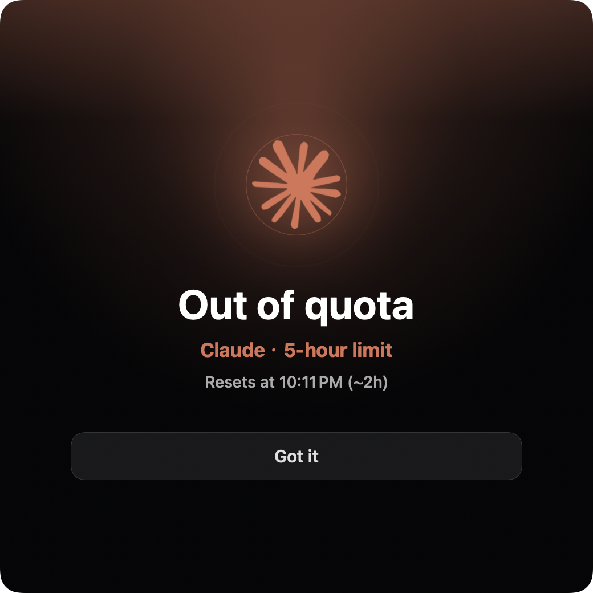
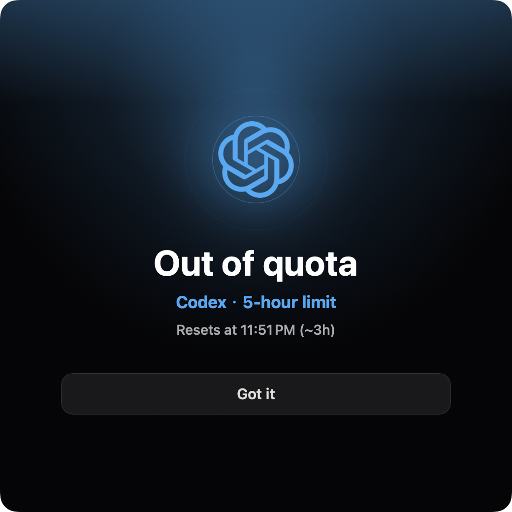

<div align="center">


# Agent Island

**Claude Code 和 Codex 的状态伴侣。**

它住在你 MacBook 的刘海里 —— 在 Windows 上则是原生顶部条 / 悬浮小窗。logo 旋转 = agent 在跑；闹钟响 = 该你了；变红 = 有事要你处理。

Mac 上有刘海无刘海都能用（刘海风格或紧凑顶部条）；Windows 版是同一套检测引擎的原生 WPF 伴侣 —— 据我们所知，Windows 上目前没有第二个这样的东西。

**[agent-island.dev](https://agent-island.dev/zh/)** · [English](README.md)

[](https://github.com/tristan666666/agent-island/releases/latest)
[](https://github.com/tristan666666/agent-island/releases)
[](https://github.com/tristan666666/agent-island/releases/latest)
[](https://github.com/tristan666666/agent-island/releases/latest)
[](LICENSE)

[](https://github.com/jaywcjlove/awesome-mac/blob/master/README-zh.md#%E8%8F%9C%E5%8D%95%E6%A0%8F%E5%B7%A5%E5%85%B7)
[](https://github.com/jaywcjlove/awesome-swift-macos-apps/blob/main/README.md#ai)
[](https://github.com/milisp/awesome-codex-cli)
[](https://github.com/kailiu42/awesome-coding-agents)
[](https://github.com/GetBindu/awesome-claude-code-and-skills)
[](https://github.com/acvnace/awesome-vibe-coding-resources#desktop-apps)

<a href="https://www.producthunt.com/products/agent-island-2?embed=true&utm_source=badge-featured&utm_medium=badge&utm_campaign=badge-agent-island-2">
  
</a>

<video src="https://github.com/user-attachments/assets/d69b41e0-9298-4f17-b6c9-6014f3bd956b" controls width="900"></video>

<p>
  <a href="#安装"><strong>安装</strong></a> ·
  <a href="https://agent-island.dev/zh/">官网</a> ·
  <a href="https://github.com/tristan666666/agent-island/releases/latest">最新 release</a> ·
  <a href="docs/roadmap.md">路线图</a> ·
  <a href="CONTRIBUTING.md">参与贡献</a>
</p>

<p><strong>如果 Agent Island 让你少守一次半夜卡住的 Claude/Codex 任务，给它一个 Star，让更多在 Mac 和 Windows 上跑这些 agent 的人找到它。</strong></p>

<table>
  <tr>
    <td align="center"></td>
    <td align="center"></td>
  </tr>
  <tr>
    <td align="center" colspan="2"></td>
  </tr>
</table>

</div>

## 为什么做它

Agent Island 出自一个 Claude Code + Codex 重度用户的两个日常：

**把每一分 token 用到位。** 两个工具一起用，就要同时盯两个额度时钟——5 小时窗口什么时候重置、现在哪边还有余量。交叉用好它们，才对得起你付的钱。所以：双家用量、成本、重置倒计时，顶部条一眼看完。

**发完一轮，就去生活。** 跟 agent 讲完一轮逻辑，你本该可以离开——陪孩子、去健身、看场电影。它跑的时候不需要你，它停下来的那一刻才需要你。Agent Island 盯的就是那个时刻：该你了就叫你，额度回来了就自动续跑你指定的会话——写代码不该霸占你的整个晚上。

这就是全部初心：机器的产出拉满，人从循环里拿回自己的生活。

## 功能

### ⚡ 顶部条上的实时状态

Claude 和 Codex 的 logo 跟着会话的真实状态动。检测是事件驱动的（FSEvents 监听本地记录文件），所以旋转的起停和真实运行只差一秒上下 —— 不是轮询式的延迟。

| 表现 | 含义 |
|---|---|
| logo **旋转** | 有会话正在跑 |
| logo **静止** | 没有任务在跑 —— 或者这一轮结束，该你了 |
| logo **红色脉冲** | 需要处理：限流、登录、网络或服务方异常 |


### 🖥️ Mac 和 Windows 都有它的位置

Mac 上，Agent Island 不只适合有摄像头刘海的 MacBook。你可以在设置里选择：

- **宽版顶部条**：适合 MacBook 的刘海风格布局。
- **紧凑顶部条**：适合无刘海 Mac、外接显示器、iMac、Mac mini 和旧款 MacBook。

Windows 上，[Agent Island for Windows](windows/) 用原生 WPF 跑同一套检测引擎，有自己的摆放模式：

- **顶部条** —— 标志性的岛屿造型，居中贴在屏幕顶边。
- **悬浮小窗** —— 可拖动、记住位置；品牌托盘图标常驻显示用量环和状态色。

无论哪种形态，都是原生轻量伴侣 —— 两个平台都没有 Electron。

### 🔔 到你回复提醒

后台会话一轮跑完时，Agent Island 会弹出前台闹钟窗口、发系统通知、播放提示音（内置几种，也可以用你自己的音频文件）。提醒在轮次真正结束后的几秒内送达。

- **回复了就自动消失** —— 你在线程里接上话，闹钟自己收窗，不留死窗口。
- **多个完成不互吞** —— 几轮同时跑完会排队提醒，关掉一个，下一个接着来。
- **「回去处理」带你回去** —— Codex 会话经 `codex://threads/…` 直投正在运行的应用、落在具体线程上；Claude CLI 会话在终端里从会话自己的目录 `claude --resume` 真正续跑；Claude Desktop 会话把 Claude Desktop 带到前台（Claude 没有任何能落到具体对话的外部入口 —— 装作能做到才是骗人）。

顶部那两张截图就是这个闹钟，两家各一张。

### ⛽ 额度用完弹窗

撞上限流和跑完一轮是两种事件，配得上两种打断：5 小时或周额度窗口一到 100%，会弹一个独立提醒，重置时间就写在上面（「22:10 恢复（约 2 小时后）」）。每个重置周期只弹一次，启动时有 warmup —— 在已经打满的窗口里打开 app 不会弹。macOS 和 Windows 都有。

<table>
  <tr>
    <td align="center"></td>
    <td align="center"></td>
  </tr>
</table>

### 🔁 额度重置后自动续跑

给会话挂一条规则：等服务方的用量窗口重置 —— 或者按"每 N 小时"固定间隔 —— Agent Island 自动给它发一句话（`继续`、`OK`，随你设），半夜停住的任务自己接着跑。


因为这个功能是无人值守运行的，配了几道闸：

- 设置里有**总开关（kill switch）** —— 关掉后，永远不会生成任何 resume 命令。
- **按项目的允许清单** —— 只有你明确放行的目录才会触发续跑。
- **运行记录** —— 每次执行或拦截都有记录，从设置里一键打开记录文件夹。

诚实的限制：Mac 必须醒着；每次续跑都会消耗 token。`--dangerously-*` 参数意味着什么，见 [FAQ 与安全](#faq-与安全)。

### 📊 用量岛

Claude / Codex 的 5 小时与周用量、成本、重置倒计时 —— 刘海里左右滑动的几页，数据来自各家自己的用量 API。当 Claude 的接口要求重新登录时，「重新认证」按钮直接在浏览器里完成（真正的 claude.com 授权页，一次点击，本地回调接住）—— 不开终端、不贴验证码。


### 🌏 原生、双语

原生 SwiftUI，不是 Electron。英文和简体中文，设置里可切换。macOS 13+，通用二进制（Apple 芯片 + Intel）。

Windows 版也有了：[Agent Island for Windows](windows/) 是同一套检测引擎的原生 WPF 移植。更多平台说明见 [agent-island.dev](https://agent-island.dev/zh/)。

<!-- launch video: coming soon -->

## 安装

> **用 Windows?** 这里有 [**Agent Island for Windows**](windows/) —— 同一套检测引擎的原生 WPF 移植([下载](https://github.com/tristan666666/agent-island/releases/latest))。

```sh
brew install tristan666666/tap/agentisland
```

**Windows**(新):

从 [最新 Release](https://github.com/tristan666666/agent-island/releases/latest) 下载 `AgentIsland-win-x64.zip`,解压运行 `AgentIsland.exe`。

或用 Scoop:

```powershell
scoop bucket add agent-island https://github.com/tristan666666/scoop-bucket
scoop install agent-island/agentisland
```

或用 winget:

```powershell
winget install TristanTang.AgentIsland
```

或直接下载 DMG:

下载 DMG，把 AgentIsland 拖进 Applications，打开：

[**下载最新版 AgentIsland.dmg**](https://github.com/tristan666666/agent-island/releases/latest)

如果 macOS 第一次启动时提示应用未公证，在 Finder 里右键 AgentIsland，选择一次 **打开** 即可。

或者源码构建：

```sh
git clone https://github.com/tristan666666/agent-island.git
cd agent-island
./scripts/verify.sh
open build/AgentIsland.app
```

## 原理

- **会话状态**读自 Claude Code / Claude Desktop / Codex 本来就写在你磁盘上的记录文件：FSEvents 监听写入，再结合轮次完成标记（Claude 的 `stop_reason: end_turn`、Codex 的 `task_complete`）和文件活动，判定旋转 / 闹钟 / 红色。
- **用量和重置时间**来自各家真实的用量 API，用的是你机器上已有的凭据。
- **自动续跑**执行 `claude --resume … -p "<消息>" --dangerously-skip-permissions` 或 `codex exec resume … "<消息>" --dangerously-bypass-approvals-and-sandbox`，运行记录在 `~/Library/Application Support/AgentIsland/trigger-runs/`。
- 全程在本机以你的身份运行，不上传任何东西。

更完整的实现拆解（英文）：[How Agent Island detects Claude Code and Codex session state](docs/how-agent-island-detects-session-state.md)。

## FAQ 与安全

**`--dangerously-*` 这些续跑参数到底做了什么？**
它们让 agent *无人值守、关掉权限确认*地恢复运行 —— 没有人点"允许"，会话才可能自己继续，这是唯一的办法。请相应地对待它：总开关、按项目允许清单、运行记录，都是为了让你把范围收在信得过的会话上。只给你放心无人值守跑的工作挂规则。

**为什么应用没有公证（notarize）？**
没有付费的 Apple 开发者账号。应用是 ad-hoc 签名的，所以首次启动 macOS 会拦一次，右键 → 打开即可。自动更新有独立校验：Sparkle 在安装前会验证每个更新包的 EdDSA 签名。

**我的数据会离开这台 Mac 吗？**
不会。Agent Island 读本地记录文件，用你本机已有的 token 调各家用量 API。应用里没有任何遥测。

**跟 codex-island 有什么不一样？**
[codex-island](https://github.com/ericjypark/codex-island) 是个被动电表 —— 告诉你用了多少。Agent Island 保留了这部分（用量、成本、重置），再加上主动的那一半：logo 上的实时会话状态、到你回复提醒、自动续跑。

## 用户交流群

扫码加作者微信,备注「Agent Island」,拉你进开源交流反馈群——聊使用体验、报问题、提想法,欢迎一起参与共建。


## 致谢与许可

Agent Island fork 自 **[codex-island](https://github.com/ericjypark/codex-island)**（作者 **Eric Park**）—— 用量岛与成本统计的底子是他的。Agent Island 在此之上加入自动续跑、到你回复提醒、实时状态动效，并走出了自己的产品方向。

MIT 许可 —— © 2026 Eric Park，本 fork 保留该声明。见 [LICENSE](LICENSE)。
