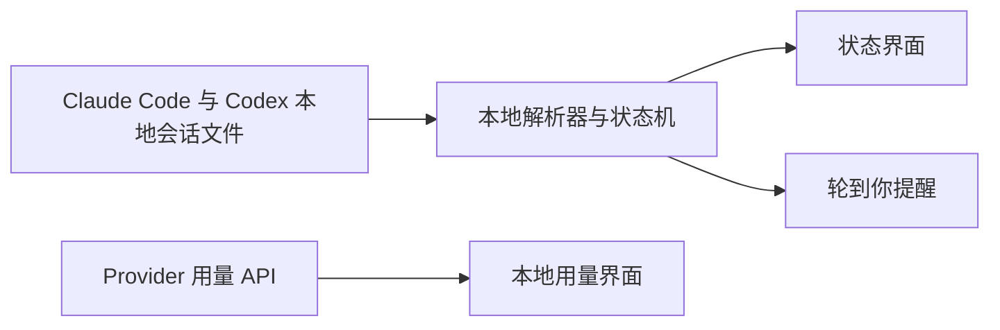

<div align="center">


# Agent Island

**Claude Code 和 Codex 的状态伴侣。**

看清每个任务正在做什么。你可以先去做别的事，轮到你时，Agent Island 会把你叫回来。监控留在本机，无需 Agent Island 账号，也没有产品遥测。

**[agent-island.dev](https://agent-island.dev)** · [English](README.md)

[](https://github.com/tristan666666/agent-island/releases/latest)
[](#macos-与-windows)
[](LICENSE)

<!-- README 核心 Demo 占位：后续加入 8-12 秒 running -> your turn -> open session 无缝循环。 -->

[快速开始](#快速开始) · [工作原理](#工作原理) · [最新版本](https://github.com/tristan666666/agent-island/releases/latest) · [参与贡献](#参与贡献)

</div>

## 为什么需要 Agent Island

长时间运行的编程 Agent，不应该要求你把所有终端一直摆在眼前。Agent Island 为 Claude Code 和 Codex 提供一个持续可见的小型状态界面，让你知道哪些任务正在运行、哪些需要注意，以及什么时候控制权已经回到你手里。

它适合这些开发者：

- 同时运行多个编程 Agent 会话；
- 让长任务在后台运行，同时处理其他工作；
- 希望在不上传会话数据的情况下获得状态和提醒。

## 快速开始

从最新 Release 下载当前 `v1.6.1` 安装包：

- **macOS 13 或更高版本：** [AgentIsland-1.6.1.dmg](https://github.com/tristan666666/agent-island/releases/download/v1.6.1/AgentIsland-1.6.1.dmg)
- **Windows 10/11 x64：** [AgentIsland-1.6.1-win-x64.zip](https://github.com/tristan666666/agent-island/releases/download/v1.6.1/AgentIsland-1.6.1-win-x64.zip)

在 macOS 上，将 AgentIsland 拖入“应用程序”。如果因为尚未公证而在首次启动时被 Gatekeeper 拦截，请在 Finder 中右键应用并选择一次**打开**。

在 Windows 上，解压 ZIP 后运行 `AgentIsland.exe`。

也可以通过包管理器安装，但包管理器中的版本可能晚于 GitHub 最新 Release：

```sh
brew install tristan666666/tap/agentisland
```

```powershell
winget install TristanTang.AgentIsland
```

```powershell
scoop bucket add agent-island https://github.com/tristan666666/scoop-bucket
scoop install agent-island/agentisland
```

## 目录

- [为什么需要 Agent Island](#为什么需要-agent-island)
- [快速开始](#快速开始)
- [随时知道每个任务正在做什么](#随时知道每个任务正在做什么)
- [轮到你时再回来](#轮到你时再回来)
- [不上传会话也能理解用量](#不上传会话也能理解用量)
- [macOS 与 Windows](#macos-与-windows)
- [工作原理](#工作原理)
- [隐私与安全](#隐私与安全)
- [常见问题](#常见问题)
- [参与贡献](#参与贡献)

## 随时知道每个任务正在做什么

Agent Island 把本地会话活动转成抬眼就能看懂的状态，无需反复打开每一个终端。


- Provider 标志旋转：会话正在工作。
- Provider 标志静止：当前没有运行，或者这一轮已经结束、轮到你了。
- 红色脉冲：会话因为错误或 Provider 状态而需要注意。

状态检测由 Claude Code 和 Codex 已经写入本机的文件事件驱动。监控这些会话不需要 Agent Island 云端账号。

## 轮到你时再回来

当后台任务结束并把控制权交还给你时，Agent Island 可以显示提醒窗口、发送系统通知，并播放你在设置中选择的提示音。多个已完成任务会排队，不会互相覆盖。

<table>
  <tr>
    <td align="center"></td>
    <td align="center"></td>
  </tr>
</table>

当已安装客户端和所在平台支持会话直达时，可以使用 **Open Session** 返回对应任务。

## 不上传会话也能理解用量

用量界面把 Provider 窗口和本地活动信息放在会话状态旁边。用量请求会使用本机已有凭据直接访问 Provider API，不会经过 Agent Island 服务器代理。


`v1.6.1` 还包含在本机渲染的周报和月报卡。API 费用估算只用于参考，不是 Provider 账单，也不能证明节省了多少钱。准确发布范围请查看 [v1.6.1 Release Notes](https://github.com/tristan666666/agent-island/releases/tag/v1.6.1)。

## macOS 与 Windows

Agent Island 为 macOS 和 Windows 分别提供原生应用。核心产品范围一致：本地会话状态、注意信号和轮到你提醒。展示方式遵循各自平台：macOS 使用菜单栏/顶部条，Windows 使用顶部条或可移动组件，并在系统托盘中保持入口。

<!-- 平台对照表占位：完成 macOS 与 Windows 行为验收后加入经过验证的能力矩阵。 -->

<!-- Windows 视觉证据占位：后续加入真实的运行/等待、轮到你提醒和用量截图。 -->

当前安装包和平台说明以[最新 Release](https://github.com/tristan666666/agent-island/releases/latest)为准。Windows 贡献者可以从 [`windows/`](windows/) 项目开始。

## 工作原理



- **会话状态：**本地 transcript 活动和回合结束标记进入本地状态机。
- **注意信号：**当前状态驱动状态岛、系统通知和排队提醒。
- **用量：**请求从应用直接访问 Provider API，不经过 Agent Island 后端。
- **报告：**聚合和图片渲染在本机完成，分享必须由用户主动触发。

工程说明：[Agent Island 如何检测 Claude Code 和 Codex 会话状态](docs/how-agent-island-detects-session-state.md)。

## 隐私与安全

- 不需要 Agent Island 账号。
- Agent Island 没有产品分析或遥测端点。
- 会话监控和报告生成在本机运行。
- Provider 用量调用使用 Provider 工具已经保存在本机的凭据。
- 只有当你主动复制或分享时，报告图片才会离开应用。
- macOS 构建使用 ad-hoc 签名，尚未经过 Apple 公证；Sparkle 会另外使用 EdDSA 签名验证每次应用更新。

## 常见问题

### 为什么不直接把所有终端一直放在眼前？

当然可以，但并行任务越多，持续盯着终端的成本就越高。Agent Island 提供持续可见的摘要，只在会话状态变化或需要你时吸引注意。

### Agent Island 会上传我的 transcript 吗？

不会。会话解析在本机完成。应用会为用量信息直接访问 Provider API，但不会把 transcript 发送给 Agent Island。

### 为什么 macOS 第一次启动时要求手动打开？

项目目前没有使用付费 Apple Developer ID，因此应用尚未公证。请在 Finder 中右键应用并选择一次**打开**。后续更新包会由 Sparkle 使用独立的 EdDSA 签名检查。

### 可以自己构建吗？

可以。macOS 构建方式：

```sh
git clone https://github.com/tristan666666/agent-island.git
cd agent-island
./scripts/verify.sh
open build/AgentIsland.app
```

Windows 项目请查看 [`windows/README.md`](windows/README.md)。

## 参与贡献

欢迎范围清晰、可以验证的小型贡献。当前适合开始的任务包括：

- [#15 为已退役功能口径增加公开文案防回归检查](https://github.com/tristan666666/agent-island/issues/15)
- [#17 更新 GitHub Issue 表单，使其符合当前产品范围](https://github.com/tristan666666/agent-island/issues/17)
- [#10 编写 Windows 贡献者构建与测试说明](https://github.com/tristan666666/agent-island/issues/10)

提交 Pull Request 前请阅读 [CONTRIBUTING.md](CONTRIBUTING.md)。本地化任务也统一标记为 [`good first issue`](https://github.com/tristan666666/agent-island/issues?q=is%3Aissue%20state%3Aopen%20label%3A%22good%20first%20issue%22)。

## 路线图与更新记录

- [路线图](docs/roadmap.md)
- [最新 Release](https://github.com/tristan666666/agent-island/releases/latest)
- [所有 Releases](https://github.com/tristan666666/agent-island/releases)
- [v1.6.1 发布片](docs/media/agentisland-1.6.1-launch-en.mp4)

这段发布片用于介绍 `v1.6.1`，不作为本 README 首屏预留的核心状态工作流 Demo。

## 社区与公开收录

[Product Hunt](https://www.producthunt.com/products/agent-island-2) · [中国独立开发者项目列表](https://github.com/1c7/chinese-independent-developer) · [awesome-mac](https://github.com/jaywcjlove/awesome-mac) · [awesome-swift-macos-apps](https://github.com/jaywcjlove/awesome-swift-macos-apps)

中文用户也可以加入[微信交流群](Assets/wechat-qr.jpg)。

## 致谢与许可

Agent Island 是 [Eric Park](https://github.com/ericjypark) 的 [codex-island](https://github.com/ericjypark/codex-island) 项目的 fork。最初的用量岛和成本追踪基础由他完成。Provider 名称和标志归各自所有者所有；本项目与 Anthropic 或 OpenAI 无隶属关系。

项目采用 [MIT License](LICENSE) 发布。Copyright © 2026 Eric Park；本 fork 保留原版权声明。
